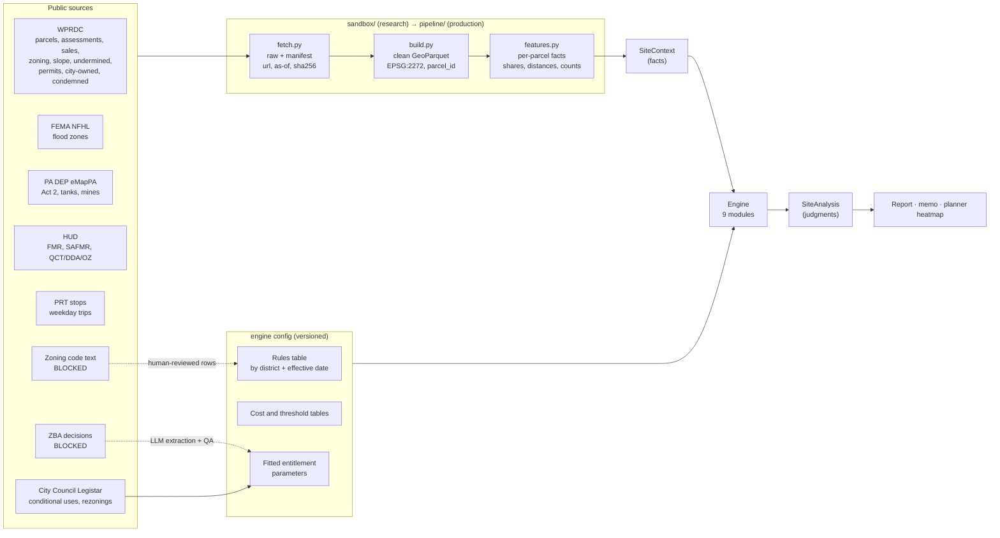
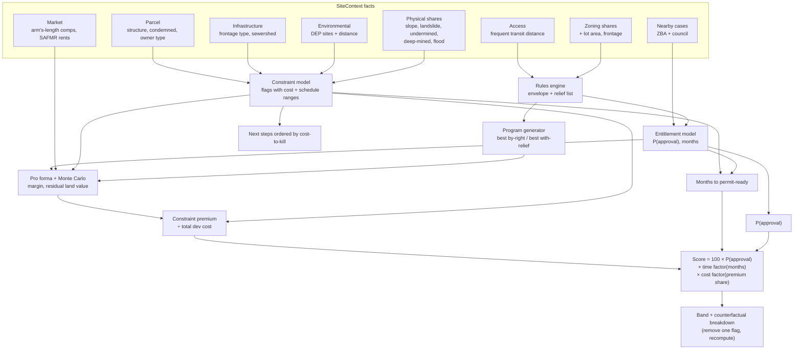
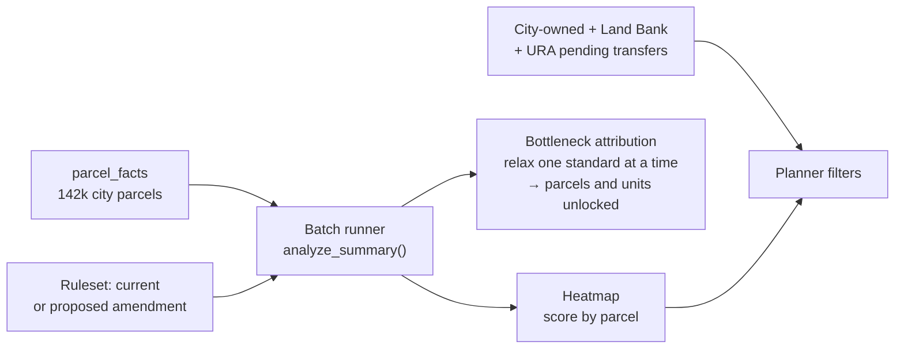

# Data plan: from public sources to the Development Ease Score

Sep 26, 2026 · research scientist workstream

## Summary

The hackathon catalog lists 60 public sources. The Navigator needs **18 of them for v1**,
**10 more as soon as v1 works**, and **5 only for the planner view**. The other 27 serve
other problem briefs (Observatory, Typology & Climate) and are left out.

Every selected source has to answer one of five questions the score and the report depend on:

1. **What can be built here by right?** Rules engine and program generator.
2. **What physical or environmental constraint adds cost or time?** Constraint model.
3. **If relief is needed, how likely is approval, and how long does it take?** Entitlement model.
4. **What is the finished product worth, and what can be paid for the land?** Pro forma.
5. **Is the site actually obtainable?** Ownership, distress, and title risk.

15 of the 18 v1 sources are already pulled and cleaned in `sandbox/`, and PASDA partly
(see `sandbox/README.md`). Two blockers remain, and both are about text, not maps:
**zoning board decisions** and the **zoning code text** are hosted on sites that refuse
our client (HTTP 403). They need a human decision, covered at the end.

## How sources were selected

A source is kept only if it passes all three tests:

| Test | Why |
| --- | --- |
| **Parcel-grain or joinable to a parcel** (spatial join, parcel id, ZIP, tract) | The product answers per site; aggregates only help as context |
| **Feeds a named engine module or a validation check** | Otherwise it is interesting but not part of the score |
| **Retrievable in bulk under our outbound rule** (`User-Agent: market-data-client/1.0`, no contact details, no sign-ups without approval) | A source we cannot refresh cannot back a production number |

## Selected sources

`#` is the row number in the catalog CSV, counting the first data row as 0. Status:
**in sandbox** = pulled, cleaned, and rolled into per-parcel facts; **add** = reachable, not
yet pulled; **blocked** = needs a decision.

### Tier 1: needed for v1

| # | Catalog source | What we retrieve | Feeds | Status |
| --- | --- | --- | --- | --- |
| 2 | Parcel Boundaries | Polygon, county id, block-lot, municipality | Parcel base; every spatial join; lot area | in sandbox (585k) |
| 0 | Property Assessments | Use, class, land/building value, year built, lot area, last sale; **drop owner mailing addresses** | `Parcel`; has-structure → demolition; land basis | in sandbox |
| 1 | Property Sale Transactions | Sale date, price, validation code, instrument | Pro forma land comps and exit values; RLV calibration | in sandbox (504k; arm's-length flag) |
| 8 | Pittsburgh Zoning Districts | District code per polygon | Rules engine input (district shares) | in sandbox |
| 9 | Pittsburgh Zoning Code | Per district: permitted residential uses, min lot, lot area per unit, frontage, height, setbacks, coverage, parking, **with section numbers** | Rules table (human-reviewed rows) | **blocked** (ecode360 403) |
| 39 | Steep Slopes ≥25% | Polygon → share of lot | Constraint model: grading/retaining cost, geotech step | in sandbox |
| 40 | Undermined Areas | Polygon → share of lot | Constraint model: subsidence flag, mine study step | in sandbox |
| 38 | PA DEP eMapPA | Act 2 cleanup sites, storage tanks, abandoned mine lands, deep-mined areas | Environmental flags; countywide undermining | in sandbox |
| 37 | FEMA NFHL | Zone A/AE, floodway, 0.2% zone → share of lot | Flood flag; floodplain permit step | in sandbox |
| 4 | PLI Permits (2019–) | New construction, demolition, floodplain permits by parcel | **By-right validation**; timeline anchors | in sandbox (65k) |
| 21 | HUD FMR / Small Area FMR | Rent by bedroom by ZIP; metro fallback | Pro forma rent (rental product) | in sandbox |
| 30 | PRT GTFS / stops | Weekday trips per stop | Distance to frequent transit → parking relief, TOD scenarios | in sandbox |
| 10 | ZBA decisions | Case, date, parcel, district, relief type, code section, outcome, days to decision | **Entitlement model** training data | **blocked** (pittsburghpa.gov 403) |
| 13/57 | City-Owned Properties | Inventory type and status, Land Bank / URA pending transfers | Owner type; planner fast-track filter | in sandbox |
| 7 | Condemned and Dead-End Properties | Parcel, status | Demolition cost; distress | in sandbox |
| 3 | County GIS portal | Street centerlines by class, municipal boundaries, address points | Frontage type; municipality; search | in sandbox |
| 34 | PASDA | Parcel history versions; mine layers (backup for DEP) | Parcel ID normalization over time | partly (parcels via WPRDC) |

Also pulled because the spec calls for them, though not in the catalog: combined sewersheds
(PWSA), historic districts and zoning overlays, city steps, URA Market Value Analysis, HUD
QCT/DDA/Opportunity Zones, and **city council zoning legislation** (Legistar API: 735
conditional uses, rezonings, and PUD/SP items from 2000–2026 with hearing and passage dates).
That last one is the only entitlement signal we can reach today.

### Tier 2: add once v1 runs end to end

| # | Catalog source | What we retrieve | Feeds | Status |
| --- | --- | --- | --- | --- |
| 35 | USGS 3DEP (1 m DEM) | Slope raster → share ≥25%, mean/max slope per lot | Countywide slope (city layer stops at the border); grading intensity, not just a yes/no | add (API reachable) |
| 6 | PLI/DOMI/ES Violations | Open violations by parcel, type, date | Property condition; rehab vs demo; title/lien risk | add |
| 54, 55 | County + City/School tax delinquency | Amount, years delinquent | Acquisition leads; title risk; cost to clear | add (we have the lien summary) |
| 56 | Mortgage Foreclosures | Filing date, status | Distress; acquisition timing | add |
| 14 | City Property Tax Abatements | Abatement program, parcel | Pro forma incentive (e.g. LERTA) | add (`city-property-tax-abatements`) |
| 5 | Historical PLI Permits (2012–2019) | Monthly permit summaries | Longer by-right validation window | add (XLS/XLSX per month) |
| 29 | BLS PPI | Construction input and new-residential indexes | Hard-cost escalation over months to permit | add (API reachable) |
| 45, 48 | Zillow ZORI/ZHVI; Realtor.com inventory | Rent and value index by ZIP, monthly | Cross-check HUD rents and sale comps; trend for exit value | add (CSV reachable) |

### Tier 3: planner view only

| # | Catalog source | Use |
| --- | --- | --- |
| 22 | HUD Income Limits | Affordable rents for inclusionary zoning and scenario rulesets (huduser.gov returns a bot challenge; needs a manual download) |
| 23 | LIHTC Database | Existing affordable stock near a site; subsidy context |
| 52 | 311 Requests | Infrastructure complaints as a local-condition proxy (reporting bias noted) |
| 16 | ACS 5-year | Demand context by tract (needs a Census API key, which requires an email sign-up) |
| 15 | Housing Needs Assessment | Citywide framing for bottleneck reports |

### Not used, and why

| Sources | Reason |
| --- | --- |
| 17 Decennial, 18 TIGER, 19 CHAS, 20 Location Affordability, 25 USPS vacancy, 26 HMDA, 27 LODES, 28 QCEW, 51 Opportunity Atlas, 58 McMADCAT, 59 Access Across America | Tract or regional aggregates that describe need or opportunity, not what a specific lot can support. Useful for the Observatory brief. |
| 41 EJScreen, 42 NLCD, 43 NOAA, 44 ResStock, 53 NCES schools | Climate and typology briefs. They do not change a v1 go/no-go on a 3–20 unit infill site. |
| 11 PA Municipal Codes | Suburban zoning is out of scope for v1. |
| 12 OneStopPGH | Interactive portal, not for bulk extraction. Manual checks only. |
| 31 PennDOT, 32 OSM, 33 OpenAddresses | County centerlines and address points already cover access and geocoding. |
| 36 Orthoimagery | Assessment data already says whether a structure exists. |
| 46 Redfin tracker, 47 Redfin migration, 49 Freddie Mac PMMS, 50 FHFA HPI | Redundant with sales and Zillow at ZIP grain. Redfin's ZIP file is 1.5 GB; PMMS is a consumer mortgage rate, not a construction-loan rate. |
| 24 NHPD | Requires registration. |

## Data flow

### End to end

Facts come only from data (left side). Every threshold, cost, and probability lives in
versioned engine config (bottom). That split is the spec's boundary rule, and it is what
lets a developer see and override each assumption.

### How facts become the score

The spec's score multiplies three terms. Each term traces to specific data:

### What each fact contributes

| Fact (SiteContext) | Built from | Engine judgment it drives | Score term |
| --- | --- | --- | --- |
| District shares, overlays | Zoning + overlays × parcel polygon | Envelope, relief items, split-zoned → low confidence | P(approval), months |
| Lot area, frontage | Parcel polygon; centerlines within 60 ft | Min lot / lot-area-per-unit / frontage checks | P(approval) via relief |
| Steep slope share | City ≥25% slope (later USGS 3DEP) | Retaining walls, grading, geotech study | Cost premium, months |
| Landslide-prone share, observed landslides | City layer; landslide inventory | Geotech severity | Cost premium |
| Undermined / deep-mined / AML shares | City layer; DEP mines | Subsidence study, foundation premium | Cost premium, months |
| Flood shares (SFHA, floodway) | FEMA NFHL | Floodplain permit; floodway can kill a deal | Cost, months, P(approval) |
| DEP sites within 1,000 ft | Act 2 + storage tanks | Phase I/II ESA step | Cost premium, months |
| Frontage type | Centerlines (street, alley, steps) + City Steps | Access and utility-extension premium | Cost premium |
| Combined sewershed | PWSA | Stormwater management requirement (proxy) | Cost premium (low weight) |
| Has structure, condemned | Assessments; condemned list | Demolition cost | Cost premium |
| Frequent transit distance | PRT stops, ≥64 weekday trips | Parking relief eligibility | P(approval) of the with-relief option |
| Arm's-length comps, SAFMR | Sales; HUD | Revenue; residual land value | Pro forma |
| Nearby ZBA / council cases | Blocked / Legistar | Approval odds and duration priors | P(approval), months |
| Owner type, liens, city inventory | Assessments land use; city inventory; liens | Acquisition path; title risk step | Next steps (not the score) |

### Planner flow (batch)

## Validation data

The same sources double as ground truth. Each spec validation check has a data source:

| Check (spec) | Ground truth | Status |
| --- | --- | --- |
| By-right agreement ≥90% | Parcels with new-construction permits (PLI 2019–, later 2012–) and no ZBA case | Permits in hand; the "no ZBA case" half is blocked |
| Entitlement backtest beats base-rate Brier | ZBA outcomes over time; council conditional uses as a partial substitute (82 items) | Council in hand; ZBA blocked |
| Pro forma sanity | Arm's-length land sales vs. residual land value on recently built parcels | In hand |
| Professional agreement 8/10 | Golden parcels reviewed by an attorney or architect | Needs picks (see below) |

## What the city data already tells us

From the first run over 142,329 City of Pittsburgh parcels:

| Fact | City parcels | Design consequence |
| --- | --- | --- |
| Touch ≥25% slope | 51.7% (15.2% are ≥ half steep) | Flag on **share**, not on presence, or half the city gets flagged |
| In the city undermined layer | 31.5% | Broad layer; use DEP deep-mined (6.2%) and AML (18.6%) to grade severity |
| In a combined sewershed | 87.2% | Nearly universal, so it cannot discriminate; keep as a low-weight proxy |
| In FEMA SFHA | 1.5% | Rare but decisive; floodway share is its own flag |
| Split-zoned (≥2 districts) | 7.3% | Dual reading + low confidence, per the spec's edge states |
| Within ¼ mile of 15-minute transit | 52.9% | Parking-relief scenarios apply to about half the city |
| DEP Act 2 site within 1,000 ft | 14.7% | Phase I ESA step is common, not exceptional |
| No structure on lot | 23.3% | Large vacant-lot pool for the planner view |
| Frontage "none" at 60 ft | 5.4% | Check before trusting; deep lots may be misread |

These are facts, not thresholds. Choosing the cutoffs is the constraint model's job and is set in validation.

## Retrieval plan

| Order | Work | Owner | Unblocks |
| --- | --- | --- | --- |
| 1 | **Decide the ZBA and zoning-code routes** (below) | Both + research scientist | Entitlement model, rules table |
| 2 | Pick 8 golden parcels from `parcel_facts` (one per spec case) and export with `sandbox.site_context` | Research | Fixtures, demo |
| 3 | Draft rules-table rows for residential districts (R1D, R1A, R2, R3, RM, H) | Research | Rules engine v0 |
| 4 | Add Tier 2 sources: violations, delinquency, foreclosures, abatements, PPI, Zillow | Research (sandbox) → Engineer (pipeline) | Richer flags, cost escalation |
| 5 | USGS 3DEP slope for golden parcels, then countywide | Research | Suburban partial reports; grading intensity |
| 6 | Historical permits 2012–2019 | Research | Longer by-right validation |
| 7 | Hand the fact definitions in `sandbox/features.py` to the engineer as SiteContext field specs | Research → Engineer | Production feature builder |

## Decisions needed

1. **Zoning Board of Adjustment decisions.** pittsburghpa.gov returns 403 to our client.
   Options: request a bulk export or an allowlist from City Planning; or have a person
   download agendas and decisions in a browser and drop them in `sandbox/data/manual/`.
   Disguising the client as a browser is off the table.
2. **Zoning code text.** ecode360 returns 403 as well. The same two options apply; Municode's
   library page loads but is a JavaScript app. The rules table is human-reviewed anyway, so
   a manual download of Title Nine is a reasonable v1 path.
3. **Census API key** (ACS, planner tier only). Requires an email sign-up, so the research scientist decides
   whether and with which address.
4. **HUD Income Limits** (planner tier). huduser.gov serves a bot challenge; a one-time manual
   download is enough.
