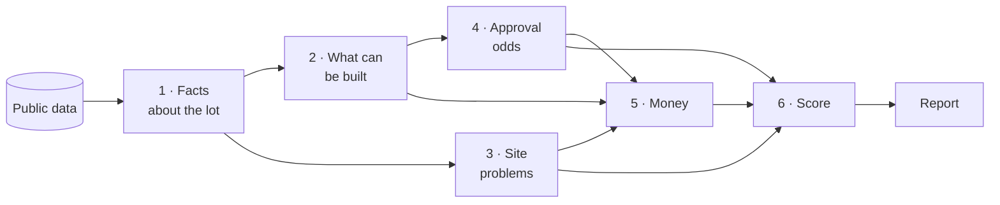
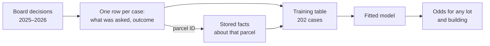
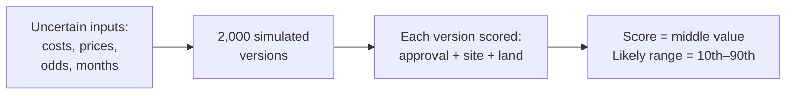

# Screening Pittsburgh Lots for Small Housing Projects: How the System Works (v0)

Research workstream · 27 September 2026 · engine 0.1.0, contracts 0.1.0, approval model
approval_v1

**How to read this document.** Sections 1 and 2 explain what the system is for and give the
whole picture in one diagram. Sections 3 to 8 then walk through the six steps of that diagram
in order, each ending with the same example lot so you can watch one answer being built.
Sections 9 to 12 cover what the user sees, how we tested it and what is still missing. The
appendices hold the reference material: where each step lives in the code, every assumption,
every data source and a glossary. No programming or statistics background is assumed; terms
are explained where they first appear and again in Appendix D.

## Summary

A small developer looking at a vacant lot in Pittsburgh has one question: *is this site worth
paying lawyers, architects and engineers to study?* Today they find out by spending that money.
This system answers the question in under a minute, from public data, before any money is
spent. Users see the answer in the web app (Pencil It).

The idea behind it fits in one sentence. **A site is risky when the building that fits on it
needs a slow or uncertain approval, costs extra to build because of the ground it sits on, or
can't earn enough to pay for the land.** The system measures each of those three things, turns
them into a score from 0 to 100, and explains every point it takes away.

Where it stands:

- It works end to end on any parcel in Allegheny County, in about a hundredth of a second.
- It draws on 46 public data sources and 344 rules taken from the city's zoning code.
- Some inputs are measured from real outcomes: recent home sales, mapped hazards, City Council
  votes, and 202 Zoning Board decisions that now set the odds for the most common approvals.
- Others are still placeholder guesses, most importantly the cost of construction. That one
  number currently decides most verdicts, so replacing it with local figures is the main job
  ahead (Section 12).

---

## 1. The question it answers

The user is a small developer planning 3 to 20 homes. For a lot they are considering, the
system tells them:

- **whether the lot is worth pursuing** (a score and a plain-language verdict),
- **what could kill the deal** (site problems, ranked worst first),
- **what they could build**, and how much they could afford to pay for the land,
- **what to check first**, cheapest checks first.

Three rules shape every answer:

- **It is a screen, not a ruling.** It never says a project is "approved" or "compliant", only
  what the zoning code allows as of a given date.
- **Every estimate is a range.** Inputs such as building costs are uncertain, so the system
  works out many possible outcomes and reports a low, middle and high value: the 10th, 50th and
  90th percentile. ("10th percentile" means 1 outcome in 10 is lower.)
- **Missing data is never good news.** If the system doesn't know something, it says "unknown"
  and suggests how to find out. It never treats a gap as a clean result.

To give those answers, the system goes through six steps. The next section shows them together.

## 2. The whole system in one picture

Read it from left to right:

1. **Facts about the lot** (Section 3). Public maps and records are turned into measurements of
   one lot: its size, its zoning, how much of it is steep, how close it is to a contaminated
   site, what nearby homes sold for.
2. **What can be built** (Section 4). The zoning code, written down as data, is applied to
   those facts. For five kinds of building (from a single house to a small apartment building)
   it says whether the building fits and which approvals it would need.
3. **Site problems** (Section 5). The physical and legal problems in the facts (slopes, old
   mines, flood zones, liens) each get an estimated cost and delay.
4. **Approval odds** (Section 6). For every approval a building needs, the chance it is
   granted and how long it takes, learned from past decisions where we have them.
5. **Money** (Section 7). What the homes would sell for, what they would cost to build
   (including the site problems, and interest while waiting for approvals), and therefore the
   most the developer could pay for the land.
6. **Score** (Section 8). Steps 3, 4 and 5 are combined into one number from 0 to 100, with a
   reason for every point lost. The report (Section 10) shows all of it.

**One design rule makes the results checkable: facts and judgments are kept apart.** A *fact* is
something measured directly from data, such as "43% of the lot is on a steep slope". A
*judgment* needs a model or an assumption, such as "that slope adds $15k–$60k to the cost".
Step 1 produces only facts, in one fixed format. Steps 2 to 6 produce only judgments, from those
facts plus a set of rules and assumptions that are written down and versioned. So the same lot
with the same data always gets the same answer, and anyone can trace a number back to its
inputs.

**The example we will follow.** Each of the next six sections ends with lot **55-H-320**, a
vacant lot on Frayne Street in Hazelwood. It is a useful example because it has a bit of
everything: a steep slope, old mines underneath, and a building that needs an approval. By the
end of Section 8 it will have a score of 43, "high risk", and you will have seen where every
point came from.

## 3. Step 1: Facts about the lot

**What the system measures.** Every fact is one of three simple kinds:

- **A share of the lot**, from 0 to 1: "43% of the lot is on a slope of 25% or more". The
  system lays the lot's outline over each hazard map and measures the overlap.
- **A distance**, in feet: "92 ft to an inactive registered storage tank".
- **A list of nearby records**: "136 home sales within half a mile in the last three years".

Together they describe the lot itself (size, current use, whether there is a building, assessed
value, type of owner), its zoning, physical hazards (steep slopes, landslide-prone ground, old
coal mines, flood zones), nearby contamination records, street access and sewer type, distance
to frequent transit, whether the neighbouring lots are built on, any tax liens or condemnation,
the local housing market (recent sales and government rent benchmarks) and nearby Zoning Board
cases. Appendix C lists which public source supplies each fact.

**Why shares and not yes/no.** Pittsburgh is hilly and sits on old coal mines. Of the city's
142,000 parcels, 52% touch some steep slope, about a third sit in the mapped undermined area and
87% are in a combined-sewer area. A yes/no flag would mark most of the city as risky. What
matters is *how much* of the lot is affected, so every later step works on shares.

**How fresh the data is.** The data comes from each source's own public service, in two ways.
A nightly job checks every source on its own schedule (daily for sales and permits, weekly for
assessments and liens, monthly for maps) and downloads it again only if it has changed. And
when someone opens a report, the records that change most often for that lot (its assessment,
liens, condemned status, city ownership, permits and any new nearby sales) are fetched live. If
a live lookup fails, the stored copy is used and the report says so. Every fact records whether
it was live or stored, and when.

**The same facts are stored for every city parcel.** The system has already computed the facts
for all 142,329 parcels in the city and stored them, one record per parcel ID. Everything that
follows, including the approval model in Section 6, reads these same stored records, so a
number in a report can always be traced back to the stored facts for that parcel.

**Known gaps.** Some hazard maps stop at the city line, so suburban lots get "unknown" for them.
Zoning Board decisions are only published online from 2025 (Section 6).

> **Following lot 55-H-320.** A vacant 2,504 sq ft lot, about 33 × 83 ft, zoned R1D-M
> (detached single houses, moderate density). 43% of it is on a slope of 25% or more, all of it
> is over mapped mine workings, and it is not in a flood zone. 136 homes sold within half a mile
> in the last three years; the 133 with a known size sold at a typical $197 per sq ft. The
> county assesses the land at $1,200.

With the facts in hand, the next question is what the law lets you build on this lot.

## 4. Step 2: What can be built, and what approval it needs

**The zoning code, turned into data.** We wrote down the parts of Pittsburgh's zoning code that
matter for small housing as 344 rows. Each row states one rule for one zoning district, the
exact section of the code it comes from and the date it took effect:

- 191 rows of dimensions: minimum lot size, how far a building must stay from each property
  line (its *setbacks*), maximum height and number of stories.
- 120 rows saying which housing types each district allows, and how: outright, or only after
  a particular kind of approval.
- 33 rows of other standards: parking, grading on slopes, flood and mine rules, backyard units.

A further 54 rows give a plain-language summary of every code section the system cites, so the
report can explain what each section requires. When the city changes its code, these rows
change, with a new date; no software has to change.

**How much fits on the lot.** Pittsburgh's residential districts don't cap the number of homes
per acre. The limit comes from geometry: take the lot's width and depth, subtract the required
setbacks, and multiply by the number of stories allowed.

> buildable floor area = (width − both side setbacks) × (depth − front and rear setbacks) × stories

On the narrow 25 to 35 ft lots common in Pittsburgh, two rules in the code make a big
difference, and the system applies both:

- **Matching the neighbours.** If the houses on both sides are built close to the property
  line, a new building may match them, down to 3 ft. We can see whether the neighbouring lots
  are built on, but not exactly where their walls are, so this is a best case the developer
  should confirm with a survey.
- **Narrow lots.** A single house on a lot under 60 ft wide gets smaller side yards
  automatically.

**Five kinds of building are tested:** a single house, a duplex, a triplex, a row of 2 to 8
townhomes, and a walk-up apartment building of 4 to 12 units. For each size of each kind, the
system checks every rule: is the use allowed in the district, is the lot big enough, does the
building fit inside the setbacks and height limit, and, for townhomes, does the row fit the lot
and can each home get its own lot. Every rule either passes or fails. A failure that an
approval can fix becomes an item on the building's list of approvals needed.

**The approval ladder.** Different approvals are decided by different bodies. Each step up
takes longer and is less certain:

| Approval | Who decides |
|---|---|
| None needed ("by right") | The permit desk |
| Administrator exception | The Zoning Administrator |
| Special exception | The Zoning Board, at a public hearing |
| Variance | The Zoning Board, which must find a hardship |
| Conditional use | The Planning Commission, then City Council |
| Rezoning | City Council |

Two judgment calls keep the options realistic. If a building misses a size rule by more than
25%, we assume a variance is unlikely and drop that option. And we don't offer buildings whose
use the district doesn't allow at all.

**Extra rules for mines and floods.** Some areas carry overlay rules on top of the district:

- Over old mines, a single house must show more than 100 ft of rock over the mine; anything
  bigger needs a professional site investigation before it can be approved.
- In a flood zone, the lowest floor, basement included, must sit 1.5 ft above the expected
  flood level.
- In the floodway itself (the channel and its banks), a new building needs an engineering study
  showing it won't raise flood levels. We treat that as close to a deal-breaker.

**The output of this step** is the full rule-by-rule result for every building tested, and from
it two candidate projects: the largest one allowed outright, and the largest one that needs
approvals, each with its list of approvals. The report shows the whole rule-by-rule table, so a
reader can see exactly why a duplex fails and a single house passes.

> **Following lot 55-H-320.** The district doesn't allow duplexes, triplexes or apartment
> buildings, and the lot is too small for a row of townhomes. A single house is allowed, but the
> setbacks leave room for 1,234 sq ft of floor area, 18% less than the 1,500 sq ft house we test.
> An 18% shortfall is within the 25% limit, so the project the system carries forward is **one
> single-family home that needs a setback variance** (§ 903.03).

Knowing what could be built, the system next looks at what the ground itself will cost.

## 5. Step 3: Site problems

Each physical or legal problem found in the facts becomes a **flag**. A flag says how serious
the problem is, a range for what it might add to the cost, a range for how much time it might
add, how confident we are, and how to resolve it.

Seriousness depends on how much of the lot is affected. For a steep slope:

- more than half the lot: serious, adding roughly $40k–$150k and 1–4 months,
- 15% to 50% of the lot: moderate, roughly $15k–$60k and up to 2 months,
- less than 15%: minor, roughly $5k–$20k.

The other flags cover landslide-prone ground, old mines (stricter for projects with more than
one home), flood zones, nearby contamination records, lots without street access, combined
sewers, existing buildings to demolish, condemned properties and unpaid tax liens (costed at the
lien amount). When a fact is missing, the system raises an "unknown" flag instead of a clean
result. All cost and time ranges in this version are expert placeholders (Appendix B).

> **Following lot 55-H-320.** Four flags are priced: the slope (moderate, $15k–$60k,
> 0.5–2 months), the old mines ($8k–$25k, 1–3 months, plus a site investigation), two
> contamination records within 1,000 ft ($0–$5k for an environmental assessment) and the
> combined sewer ($5k–$20k). Together they could add **$28k–$110k** to the cost.

Site problems cost money and time. The other source of delay and risk is the approvals, which
the next section estimates.

## 6. Step 4: Approval odds and timing

For every approval a building needs, the system estimates **the chance it is granted** and
**how many months it takes**. Where the odds come from depends on who decides:

| Approval | Decided by | Where the odds come from |
|---|---|---|
| Variance, special exception | Zoning Board, at one hearing | **A statistical model** fitted on 202 of the board's decisions (6.2) |
| Conditional use, rezoning | City Council | **Measured** from Council votes (6.1) |
| Administrator exception | Zoning Administrator | Expert estimate (no decision data yet) |
| Subdivision | City Planning | Expert estimate (no decision data yet) |

### 6.1 Approvals decided by City Council

City Council's records from 2000 to 2026 cover two kinds of approval. Of 29 conditional uses
that reached a vote, 27 passed, typically in about 60 days (10% under 44 days, 10% over 162). Of
101 rezonings, 91 passed, typically in 79 days. The system turns these counts into a range of
probabilities (a Beta distribution), which is wider when there are fewer cases.

### 6.2 Approvals decided by the Zoning Board: a statistical model

Variances and special exceptions are the approvals small projects need most: a building a few
feet too wide for its setbacks, a lot slightly too small, a use the district allows only "by
special exception". Their odds come from a model fitted on the board's own decisions. The
picture below shows how it is built; the text after it walks through each arrow.

**Where the data come from.** The city posts every Zoning Board hearing on its website: an
*agenda* listing the cases heard and, some weeks later, the board's *written decision* for each
case. We downloaded the agendas and decisions of all 63 hearings from January 2025 to October
2026, following the site's rules for automated access. (Older hearings are not published in a
form we may download.) The files stay on our machine and are never shared, because decisions
name the applicants.

**From documents to cases.** Every decision starts with the same header (case number, dates,
lot and block, zoning district, what was requested, each approval asked for with its code
section) and ends with the ruling ("…is hereby APPROVED", "…DENIED"). A program reads those
parts, keeps no names, and links each case to its county parcel ID. We checked it by reading 30
decisions by hand: it agreed on the case number and district in all 30, and on granted versus
denied in 29; the one miss (a request partly withdrawn and partly denied) was fixed.

**Two kinds of information per case, each from where it is recorded.**

- **What was asked for**: which approvals, which rule each relaxes, whether it is for homes.
  Only the decision records this, so it comes from the decision.
- **What the parcel is like**: its zoning, market, size, whether it is vacant, its slope, mine
  and flood conditions. This comes from **our stored facts for that parcel ID** (Section 3),
  not from the document. So the model learns from exactly the facts the system uses when it
  scores any other lot.

**The sample.**

| | Cases |
|---|---|
| Cases on the 2025–2026 agendas and decisions | 295 |
| No written decision posted yet | 74 (left out) |
| Board found no approval was needed | 9 (left out) |
| Ruling could not be read | 4 (left out) |
| Ruled on something other than a variance or special exception | 5 (left out) |
| Parcel not found in our data | 1 (left out) |
| **Cases used: rulings on variances or special exceptions** | **202** (Feb 2025 – Aug 2026) |
| of which granted (including with conditions, or in part) / denied | 174 (86%) / 28 (14%) |
| decided in 2025 / 2026 | 111 (90% granted) / 91 (81% granted) |

202 cases with 28 denials is a small sample for this kind of model, and that shapes the choices
below.

**What the model predicts (the "left-hand side").** One row per hearing, because the board rules
on all of a case's requests together: 1 if the board granted them, 0 if it denied them. The
model's output is a probability between 0 and 1. This kind of model is called a *logistic
regression*.

**What it can use to predict (the "right-hand side").** Each candidate variable must be
measurable in two situations: from a past decision, to fit the model, and for a building that
has never been proposed, to use it.

| Variable | Meaning | For a past case | For a new proposal | Cases with it (granted with vs. without) |
|---|---|---|---|---|
| Baseline | Any hearing (reference: one that includes a variance) | — | — | 202 |
| Special exceptions only | Every request is a special exception | the decision | the zoning check (Section 4) | 38 (95% vs 84%) |
| Number of approvals | Requests beyond the first | the decision | the zoning check | average 0.16 |
| Housing | The request is for homes | the decision's wording | always yes | 60 (90% vs 85%) |
| Rule relaxed | use / lot size / setback / height / parking | the decision's code sections and wording | the failed rule | 78 / 3 / 33 / 9 / 12 |
| Residential district | Zoned R1D, R1A, R2, R3, RM or H | stored parcel facts | stored parcel facts | 121 (87% vs 85%) |
| Strong market | URA market type A to E | stored parcel facts | stored parcel facts | 119 (82% vs 93%) |
| Lot size | log(area ÷ 3,000 sq ft) | stored parcel facts | stored parcel facts | all |
| Vacant lot | No building on the lot | stored parcel facts | stored parcel facts | 46 (93% vs 84%) |
| Steep slope | A quarter or more of the lot on a 25%+ grade | stored parcel facts | stored parcel facts | 41 (95% vs 84%) |
| Undermined | Any part over mapped mines | stored parcel facts | stored parcel facts | 38 (84% vs 87%) |
| Flood zone | Any part in the 1% flood zone or floodway | stored parcel facts | stored parcel facts | 11 (73% vs 87%) |

Whether neighbours came to oppose a request is recorded in decisions but left out on purpose: it
can't be known when a site is being screened.

**How the model is fitted.** It combines the variables into one number and turns it into a
probability:

> P(granted) = 1 / (1 + e^(−z)), where z = β₀ + β₁ × (special exceptions only) + Σ βₖ × (other variable k)

Each β (coefficient) says how much a variable moves the odds. With few cases, a model fitted
from scratch can swing to extreme values, so it starts from what we believed before (the
*prior*): the old expert guesses of 70% for a variance hearing and 80% for special exceptions,
give or take about 10 points, and "no effect" for every other variable. The decisions then move
those beliefs (the result is the *posterior*). The fitted model keeps the full uncertainty of
every coefficient, not just a best guess.

**Which variables made the cut.** We fitted seven versions, each adding one group of variables,
and scored each on cases it had not seen: in five rounds, 4/5 of the cases fit the model and it
predicted the other 1/5; separately, a model fitted on 2025 predicted 2026. The score is *log
loss*, the standard penalty for confident wrong probabilities (lower is better). The rule,
fixed in advance: keep the simplest version unless a richer one lowers the log loss by more
than 0.005.

| Version | Log loss, unseen cases | Log loss, 2026 |
|---|---|---|
| Approval type only | 0.398 | 0.480 |
| + number of approvals | 0.399 | 0.480 |
| + housing | 0.396 | 0.475 |
| + rule relaxed | 0.401 | 0.477 |
| + district, market, lot size | 0.401 | 0.542 |
| **+ site conditions (vacant, slope, mines, flood)** | **0.389** | **0.462** |
| All variables | 0.398 | 0.509 |

Only the site conditions, read from our stored parcel facts, predict better on both tests. The
model in use therefore has six coefficients:

| Coefficient | Prior | Fitted (uncertainty) | What it means |
|---|---|---|---|
| Baseline: variance hearing, built lot, no hazards | 0.85 (70%) | **1.36** (±0.22) | 80% granted |
| Special exceptions only | 0.54 | **+0.85** (±0.39) | higher odds |
| Vacant lot | 0 | **+0.83** (±0.50) | higher odds: nothing existing is made worse |
| Steep slope | 0 | **+0.95** (±0.54) | higher odds (explained below) |
| Undermined | 0 | −0.07 (±0.45) | no clear effect |
| Flood zone | 0 | −0.52 (±0.61) | lower odds, but only 11 cases, so very uncertain |

In probabilities (middle value, with the 10th–90th percentile range):

| Hearing | Approval odds |
|---|---|
| Variance, built lot, no hazards | 80% (75–84%) |
| Variance, vacant lot | 90% (83–94%) |
| Variance, vacant lot on a steep slope | 96% (91–98%) |
| Variance, built lot in a flood zone | 70% (52–84%) |
| Special exceptions only, vacant lot | 96% (91–98%) |

**Why a steep slope *raises* the odds.** Of 41 rulings on steep lots, 39 were granted (95%, vs 84%
elsewhere), and the effect holds whichever other variables are in the model. Two reasons make it
plausible. Pennsylvania's test for a variance asks for a hardship caused by the property's
physical conditions, and a steep slope is the classic example. And steep lots discourage
ambitious projects, so what reaches the board tends to be modest (parking, walls, fences, small
homes). This is about the board's decision once a request is filed, not about steep land being
good to build on: the slope is still charged as a site cost and delay (Section 5), so a steep
lot's score goes down overall. The evidence is thin: two denials among 41 cases, with a 96%
chance the effect is positive.

**One trend to watch.** 2026 decisions were granted less often than 2025 ones (81% vs 90%). The
model pools both years; a time trend can be added once more decisions are published, and
refitting is one command (Appendix A).

### 6.3 From the model to odds for any lot

The model never needs the lot itself to have a history at the board. It predicts from what a
proposal would ask for and from the lot's facts, so it works for every lot and every building:

1. **The zoning check** (Section 4) lists the approvals a building needs, for example "variance
   (§ 903.03)" when the building doesn't fit the setbacks.
2. **Approvals are grouped by who decides.** Variances and special exceptions go to one Zoning
   Board hearing; the others to the Zoning Administrator, City Planning or Council.
3. **The hearing's variables** are filled in exactly as for the past cases: the request from the
   zoning check, the lot from its stored facts.
4. **The odds are drawn, not just computed.** The money model (Section 7) simulates each project
   2,000 times. In each simulation the six coefficients are drawn from their fitted uncertainty
   and give one probability. So the report's range for the odds reflects how sure the model is.
5. **Approvals from other bodies multiply in**, simulation by simulation: the Council's measured
   ranges, and the expert ranges for administrator exceptions and subdivisions.
6. **Time.** The months for each approval still come from expert ranges (a variance 2–7 months
   from filing). The decisions show that the ruling itself comes 20–46 days after the hearing
   (35 typical), but not when the application was filed, so the full duration can't be measured
   yet. The time to a building permit is then the city's permit review plus whichever takes
   longer: the approvals or the site studies from Section 5.

The odds for every city lot and every building type are stored alongside its facts, so they
can be looked up by parcel ID without rerunning anything.

**Cautions.** Only requests that were filed and decided are seen. Applicants tend not to file
weak cases, so the odds are for "a request like this, once filed", and they are likely
optimistic for unusual proposals; the same applies to the Council rates. And requests the board
rarely sees (lot-size variances: 3 cases) can't be told apart from the average yet.

> **Following lot 55-H-320.** The single house needs a variance. The lot is vacant (+0.83),
> steep (+0.95) and undermined (−0.07), not in a flood zone, so z = 1.36 + 0.83 + 0.95 − 0.07 =
> 3.08 and **P = 96%** (89–98% across simulations). The approval and site studies together put
> a building permit **about 8 months** away (6 to 9).

The system now knows what can be built, what the site adds, and how likely and how slow the
approvals are. The remaining question is whether the project makes money.

## 7. Step 5: Money

The financial model (a *pro forma*) asks: what could the finished homes sell or rent for, what
would they cost to build, and so how much is left to pay for the land?

**What the homes are worth.** The system looks at home sales within half a mile in the last
three years.

- If at least five newly built homes (built since 2010) sold nearby, it uses their price per
  square foot directly.
- If not, it uses older homes and adds an assumed premium for new construction.
- For apartment buildings it also estimates a rental value (yearly rent from government
  benchmarks, minus operating costs, divided by an investor's expected return) and uses
  whichever value is higher, since a developer would pick the better option.

**What it costs.** Construction cost per square foot, design and permit fees, a contingency,
the site problems from Section 5, and interest: on the land for the whole time it takes to get
permits and build, and on the construction spending while building.

**The key output is the maximum land price**: the most a developer could pay for the land and
still earn their target profit (15% on cost by default).

> maximum land price = (sale value ÷ 1.15 − all other costs) ÷ (1 + interest on the land while waiting)

If it is negative, the project loses money even if the land is free. It is compared with the
land price: the asking price if the user enters one, otherwise the county's assessed land
value, or for a lot with a building on it, the assessed value of land and building together
(buying the lot means buying the building; its demolition is a site cost).

**Handling uncertainty: 2,000 simulated versions.** Costs, prices, delays and approval odds are
all uncertain. So instead of one calculation, the system runs the project 2,000 times, each
time drawing every uncertain input at random from its range, and reports the 10th, 50th and
90th percentile of the results. The draws use a fixed starting point, so the same lot always
gives the same numbers. In this version the inputs are drawn independently of each other.

> **Following lot 55-H-320.** The 1,500 sq ft house would sell for about **$364k**. Building it,
> including $69k of site problems and interest, costs about **$585k**. The maximum land price is
> therefore **−$234k** (−$305k to −$171k): even with free land, the house costs more to build
> than it is worth, at our placeholder construction cost of $250 per sq ft.

All the ingredients are now in place. The last step combines them into the score.

## 8. Step 6: The score

The score adds up three parts, so every point can be traced to one of them:

| Part | Up to | Full points when… | Points fall as… |
|---|---|---|---|
| **Approval path** | 35 | no approval is needed and the permit is quick | the approval odds fall and the wait grows (a 6-month wait alone costs 28% of the points) |
| **Site cost** | 35 | there are no costly site problems | site problems grow as a share of the building cost; zero at 30% |
| **Land headroom** | 30 | the maximum land price is at least 1.5 × the land price | the project can afford less of the land; zero if it can't pay for land at all |

As one formula, with P the approval odds, M the months to a permit, π the site problems as a
share of all costs except land, and L\* the maximum land price:

> score = 35 × P × e^(−M/18) + 35 × (1 − π/0.30) + 30 × L\* ÷ (1.5 × land price), each part kept between 0 and its maximum

The site-cost share leaves the land price out on purpose: a pricier lot should never make the
same site problems look smaller.

Scores of 75 and up are **fast track**, 50 to 74 **feasible with conditions**, and below 50
**high risk**. A site can't be called fast track if any important finding has low confidence.
The weights (35/35/30) and the scale constants (18 months, 30%, 1.5×) are starting values, not
yet fitted to real outcomes.

**The score is computed in every one of the 2,000 simulations.** The report shows the middle
value as the score and the 10th–90th percentile as its likely range:

**Which project the verdict describes.** A lot may have two candidates (Section 4). If the one
allowed outright makes money, the verdict describes it. If not, it describes whichever
profitable candidate has the best combination of approval odds and profit. If nothing makes
money, it describes the less risky one. (Without that last rule the system would prefer a
riskier losing project, because multiplying a loss by a lower chance of approval makes the loss
look smaller.)

**Explaining the score.** For each flag, the system recomputes the score as if that problem
weren't there. The difference is the number of points the flag cost, and the report lists them
from largest to smallest.

**Why the score is built this way.** An earlier design multiplied approval, time and cost
together and ignored profit. In testing, one lot scored 78 ("fast track") while its project
would lose 20% on cost. Adding land headroom fixed that, and adding the parts (rather than
multiplying them) lets the report say exactly where the points went.

### 8.1 Worked example: every number for lot 55-H-320

This follows one score from inputs to result. Every number can be reproduced by running the
command in Appendix A for lot 55-H-320.

**The lot and the building.** A vacant 2,504 sq ft lot zoned R1D-M, 43% steep, fully over old
mines; one 1,500 sq ft single-family home that needs a setback variance (Sections 3–4).

**Step 1: the uncertain inputs, drawn 2,000 times.** Assumptions are drawn from triangular
ranges (low / most likely / high), site-problem costs uniformly within their range, and the
approval odds from the model.

| Input | Range (low / most likely / high) | Source |
|---|---|---|
| Sale price per sq ft | $158 / $197 / $228 | 25th / 50th / 75th percentile of the 133 nearby sales with a known size |
| New-construction premium over resale | 10% / 25% / 40% | placeholder |
| Construction cost per sq ft | $200 / $250 / $320 | placeholder |
| Design and permit fees; contingency | 15 / 20 / 25% of construction; 5 / 7 / 10% of both | placeholder |
| Interest rate; construction time | 7 / 9 / 11% a year; 9 / 12 / 16 months | placeholder |
| Permit review | 2 / 3 / 5 months | placeholder |
| Steep slope | $15k–$60k and 0.5–2 months | placeholder flag range |
| Old mines | $8k–$25k and 1–3 months | placeholder flag range |
| Contamination records; combined sewer | $0–$5k; $5k–$20k, each 0–1 month | placeholder flag ranges |
| Months for the variance | 2 / 4 / 7 | placeholder |
| Approval odds | the Zoning Board model | 202 board decisions |

**Step 2: approval odds.** The lot's variables are baseline 1, special exceptions only 0,
vacant 1, steep 1, undermined 1, flood 0. At the fitted values, z = 1.36 + 0.83 + 0.95 − 0.07 =
3.08 and P = 1 / (1 + e^(−3.08)) = 95.6%. With the coefficients drawn from their uncertainty,
P runs from 89% to 98%.

**Step 3: months to a permit.** Permit review plus the longer of (approval months, site-study
months) = **7.7 months** (6.2 to 9.3).

**Step 4: money.** Sale value = 1,500 sq ft × price × (1 + premium) = **$364k**. Cost except
land = construction + fees + contingency + site problems + interest while building = **$585k**,
of which site problems are **$69k**. Maximum land price = ($364k ÷ 1.15 − $585k) ÷ (1 + interest
on the land) = **−$234k**.

**Step 5: score each simulation.**

| Part | Formula with this lot's middle values | Middle | 10th–90th |
|---|---|---|---|
| Approval path | 35 × 0.957 × e^(−7.7/18) | **21.7** | 19.4–23.8 |
| Site cost | 35 × (1 − 0.117/0.30), where 0.117 = $69k ÷ $585k | **21.3** | 17.4–25.0 |
| Land headroom | 30 × (−$234k) ÷ (1.5 × $1,200), kept at 0 | **0** | 0 in every simulation |
| **Score** | the three added, per simulation | **43.0** | **38.5–47.3** |

**Step 6: summarize.** The report shows **43, likely 38–47**, with bars for the three parts (22,
21, 0). 43 is below 50, so the band is **high risk**. The spread comes from the site-problem
costs and the approval odds and timing; the land part is zero in every simulation.

**What the approval model contributes.** With the old expert guess for a variance (50–85%, most
likely 70%), the same lot gets P = 68%, 16 approval points and a score of **37** (likely 32–41).
The model raises the odds to 96%, because vacant and steep lots are granted more often, adding 6
points. The odds enter only the approval part and the choice of project; the site-cost and land
parts assume the project goes ahead, and delays reach them only through interest on the land.

## 9. What to check next

Each flag comes with a concrete check: what to do, who does it, and roughly what it costs. The
checks are ordered so that free ones come first (such as a pre-application meeting with City
Planning), followed by the check most likely to kill the deal for the least money. The idea is
to spend a little to learn a lot, and to stop early on bad sites. Each approval the building
needs points to the step that starts it, and each flag to the step that resolves it.

How likely a check is to kill a deal is set, for now, by the flag's seriousness: 30% for
serious, 10% for moderate, 15% for unknown and 3% for minor. These are placeholders.

> **Following lot 55-H-320.** Six checks: a free zoning pre-application meeting (which also
> starts the variance), a sewer capacity inquiry ($0–$500), a grading review ($2k–$4k), a
> survey of the neighbours' setbacks ($2k–$4k), an environmental assessment ($3k–$5k) and a
> geotechnical investigation of the mines ($8k–$25k).

## 10. What the report shows

Every answer is one structured record per lot; the report is only a display of it. From top to
bottom, each part of the report comes from one step of this document:

| Report part | What it shows | From |
|---|---|---|
| Verdict | Score, likely range, band and one plain sentence | Section 8 |
| Where the score comes from | The three parts, each with its points and a one-line reason | Section 8 |
| Key numbers | Months to a permit, approval odds, maximum land price vs. land price, site-problem cost | Sections 5–7 |
| What could kill this deal | The flags, worst first, each with cost, delay, source, date, code section and confidence | Section 5 |
| What you can build | The two candidates, with profit margin, timing, approvals and where the odds come from | Sections 4, 6, 7 |
| Rule by rule | Every rule (rows) for every building type (columns): pass, the approval needed or "not feasible", with approval odds at the bottom | Sections 4, 6 |
| Evidence | For each flag or approval: what the code section requires in plain words, similar past board cases nearby, and how to resolve it | Sections 4, 6 |
| What to check next | The ordered checks, with who does each and the cost | Section 9 |
| Assumptions | Every assumption with its value and range, marked measured or placeholder, plus data dates and versions | Appendix B |

## 11. Testing it on real lots

We picked eight real Pittsburgh lots, each chosen to test one situation while everything else
about the lot is clean:

| Situation tested | Lot | Zoning | Score | Project the verdict describes | Main reason for the score |
|---|---|---|---|---|---|
| Clean lot | 52-H-93 | RM-M | 62, with conditions | 4-unit walk-up, allowed outright | can't pay for land |
| Steep slope | 55-A-137 | R1D-M | 40, high risk | single house, allowed outright | 84% of the lot is steep |
| Old mines | 4-A-303 | RM-M | 55, with conditions | triplex, allowed outright | mine site investigation required |
| Needs an approval | 129-J-37 | R2-L | 56, with conditions | single house, administrator exception | lot smaller than the minimum |
| Flood zone | 80-N-159 | R1A-VH | 48, high risk | single house, allowed outright | half the lot in the flood zone |
| Two zoning districts | 24-J-60 | LNC and R1A-VH | 48, high risk | single house, allowed outright | existing house to demolish; one district not yet encoded |
| City-owned lot | 173-E-82 | RM-M | 61, with conditions | triplex, allowed outright | can't pay for land |
| Outside the city | 176-C-275 | none | not scored | none | suburban zoning not covered; partial report |

Each lot followed the path it was chosen to test. The mine lot triggered the required site
investigation. The two-district lot showed both readings and was marked low confidence. The
suburban lot came back with "unknown" results rather than false clears.

**The main finding.** At the placeholder construction cost of $250 per square foot, *none* of the
eight projects can pay for its land: the maximum land price ranges from −$74k to −$724k. One
unmeasured number is driving every verdict. On the clean lot (52-H-93) the project breaks even
at about $198 per square foot; at $170 it could pay about $139k for the land and would score 77
(fast track).

**Checks done and still to run:**

- *Done:* the approval model predicts unseen Zoning Board decisions better than the average
  approval rate (Section 6.2), by a small margin.
- *To run:* do lots that got a building permit without any approval since 2019 (65,000 permits)
  score as "allowed outright"? Target: 90% agreement.
- *To run:* do a land-use lawyer or architect agree with the flags and approval path on 10 lots?
  Target: 8 of 10.

## 12. Limitations and open questions

1. **Construction cost is a guess.** It drives most verdicts (Section 11). Real local cost
   figures from builders are the most valuable next step.
2. **A short Zoning Board history.** The approval model rests on 202 decisions from 2025–2026
   with 28 denials: enough for rates by approval type and a few site conditions, estimated
   loosely. Administrator exceptions and subdivisions still rely on expert estimates, and the
   time from filing to a hearing isn't measured.
3. **The score isn't calibrated.** Its weights and constants should be fitted so that the bands
   match real outcomes, such as permits issued and projects completed.
4. **Inputs move independently.** In reality costs and prices tend to rise and fall together.
   The simulations ignore that for now.
5. **Older homes stand in for new ones.** Where fewer than five new homes sold nearby, prices
   come from older homes plus an assumed premium.
6. **Some things can't be seen in the data:** exactly where the neighbours' walls are, how long
   the lot's street frontage is, and how deep the old mine is below the lot.
7. **City-only maps.** Slope and mine maps stop at the city line, and suburban zoning is not
   covered yet.
8. **Mixed data dates.** Sources range from 2018 to 2026; the report shows the oldest one.
9. **The project the verdict describes can switch.** Close to break-even, a small cost change
   can switch which candidate the verdict describes, and the score can jump. On the clean lot
   the score is 58 at $195 per square foot and 66 at $190, because the verdict switches from a
   6-unit to a 4-unit building. A smoother rule, such as averaging over the candidates, is
   planned for the next version.

---

## Appendix A. Where each step lives in the code

Paths are relative to the repository root. Reproduce any lot's numbers with
`uv run python -m sandbox.navigator <parcel ID or block-lot> --no-live` (for example
`55-H-320`).

| Concept (section) | Module · function | Configuration / data |
|---|---|---|
| Source downloads and provenance (3) | `pipeline/src/navigator_pipeline/fetch.py` · `fetch`, `fetch_wprdc`, `fetch_arcgis`, `fetch_legistar` | `navigator_pipeline/catalog.py` (`SOURCES`) |
| Nightly refresh (3) | `navigator_pipeline/refresh.py` · `run`, `is_due`, `has_changed`, `tables_for` | `catalog.py` (`REFRESH_DAYS`) |
| Live per-parcel lookups (3) | `navigator_pipeline/live.py` · `fetch_all`; `site_context.py` · `_apply_live` | `TIMEOUT_S`, `CACHE_TTL_S` |
| Cleaning, reprojection, parcel keys (3) | `navigator_pipeline/build.py` · `build_parcels`, `BUILDERS` | — |
| Share and distance facts (3) | `navigator_pipeline/features.py` · `area_shares`, `nearest_distance`, `physical`, `flood`, `zoning`, `environmental`, `infrastructure`, `access`, `ownership` | `ENV_RADIUS_FT`, `FRONTAGE_RADIUS_FT`, `TRANSIT_TIERS` |
| Facts for one lot (3) | `navigator_pipeline/site_context.py` · `build` | `COMPS_RADIUS_FT`, `COMPS_YEARS` |
| Stored facts and scores for every city parcel (3, 6.3) | `navigator_pipeline/score_all.py`; lookups: `navigator_pipeline/scores.py` · `load`, `context`, `approval_odds` | `data/scores/` (local) |
| Fact format (3) | `contracts/src/navigator_contracts/site_context.py` · `SiteContext` | `contracts/schema/SiteContext.schema.json` |
| Rules extraction (4) | `sandbox/rules/extract.py` · `residential_rows`, `hillside_rows` | `engine/src/navigator_engine/config/rules/residential_draft.csv` |
| Use permissions, standards, code summaries (4) | `engine/src/navigator_engine/rules_engine.py`; `code.py` | `config/rules/use_permissions_draft.csv`, `standards_draft.csv`, `code_sections.csv` |
| Buildable envelope, neighbour and narrow-lot setbacks (4) | `rules_engine.py` · `envelope`, `lot_dimensions`, `neighbors_built`, `single_unit_side_setback` | `CONTEXTUAL_MIN_SIDE_FT` |
| Building types, approvals list, 25% cap (4) | `rules_engine.py` · `check_program`, `evaluate_programs`, `best_programs`, `TEMPLATES` | `MAX_DIMENSIONAL_SHORTFALL` |
| Mine and flood overlays (4) | `rules_engine.py` · `overlay_items`, `site_checks` | — |
| Flags, thresholds, unknowns (5) | `engine/src/navigator_engine/constraints.py` · `flags` | inline threshold table |
| Approval odds and months for all bodies (6) | `engine/src/navigator_engine/entitlement.py` · `sample` | `RUNGS`, `PROCEDURAL` |
| Council outcomes (6.1) | `navigator_pipeline/build.py` · `build_council_zoning_matters` | `data/clean/council_zoning_matters.parquet` |
| Zoning Board decisions: download and case table (6.2) | `navigator_pipeline/zba_download.py`; `navigator_pipeline/zba.py` · `parse_decision`, `parse_agenda`, `link_parcels` | `data/manual/zba/` (local), `data/clean/zba_cases.parquet` |
| Approval model: variables and prediction (6.2, 6.3) | `engine/src/navigator_engine/approval.py` · `features`, `site_features`, `rule_of`, `sample` | `config/models/approval_v1.json` |
| Approval model: fitting and validation (6.2) | `research/src/navigator_research/approval_model.py` · `design`, `fit_map`, `metropolis`, `cross_validate`; refit with `uv run python -m navigator_research.approval_model` | `docs/approval-model.md` |
| Nearby and similar board cases (6, 10) | `navigator_pipeline/site_context.py` · `_zba_nearby`; `engine/src/navigator_engine/precedents.py` · `similar_cases` | `SIMILAR_RADIUS_FT`, `SIMILAR_YEARS` |
| Sale prices, rents, pro forma, simulations (7) | `engine/src/navigator_engine/analyze.py` · `sale_psf`, `rent_for`, `proforma` | `assumptions.py`; `N` |
| Score, bands, summary ranges (8) | `analyze.py` · `score_samples`, `band`, `_range` | `WEIGHTS`; `score_*` assumptions |
| Choice of project, explanation, verdict text (8) | `analyze.py` · `analyze`, `explain` | — |
| Next steps (9) | `analyze.py` · `analyze` (next steps); `constraints.py` actions | `P_KILL` |
| Output format (10) | `contracts/src/navigator_contracts/site_analysis.py` · `SiteAnalysis` | `contracts/schema/SiteAnalysis.schema.json` |
| Report display (10) | web app `web/src/pages/ReportView.tsx`; reference renderer `sandbox/report.py` | — |
| Demo data for the web app (10) | `navigator_pipeline/publish.py` · `publish`; `bundle.py` · `load` | `results/` (see `results/README.md`) |
| Test lots (11) | `sandbox/golden.py` · `cases`, `rank` | `fixtures/golden/`, `sandbox/golden_parcels.json` |
| Format checks (11) | `contracts/tests/test_golden_fixtures.py` | — |

## Appendix B. Assumptions

| Assumption | Most likely | Range | Status |
|---|---|---|---|
| Construction (hard) cost per gross sq ft | $250 | $200–320 | placeholder |
| Design and permit fees (share of construction) | 20% | 15–25% | placeholder |
| Contingency (share of construction + fees) | 7% | 5–10% | placeholder |
| Construction time | 12 months | 9–16 | placeholder |
| Interest rate | 9% a year | 7–11% | placeholder |
| Target profit on cost | 15% | — | developer input |
| New-construction premium over resale | 25% | 10–40% | placeholder |
| Investor return for rentals (cap rate) | 6.5% | 5.5–7.5% | placeholder |
| Operating costs and vacancy (share of rent) | 40% | 35–45% | placeholder |
| Permit review | 3 months | 2–5 | placeholder (permit data lacks application dates) |
| Score constants: wait scale, site-cost scale, land ratio | 18 months, 30%, 1.5× | — | not yet calibrated |
| Largest size shortfall a variance can fix | 25% | — | placeholder |
| Flag cost and delay ranges | per flag (Section 5) | — | placeholder |
| Chance a check kills the deal, by seriousness | 30% / 10% / 15% / 3% | — | placeholder |
| Zoning Board approval odds | model approval_v1 (Section 6.2) | — | fitted on 202 board decisions |
| Administrator exception, subdivision odds | per approval (Section 6) | — | placeholder |
| Conditional use, rezoning odds and durations | Beta(28, 3), Beta(92, 11); observed days | — | measured (Council, 2000–2026) |
| Comparable sales, rents | per lot | — | measured (county sales; HUD) |

## Appendix C. Data sources

| Source (who publishes it) | What it supplies |
|---|---|
| Parcel boundaries, property assessments (Allegheny County, via WPRDC) | Lot outline, size, use, building, assessed values, type of owner |
| Property sales (County) | Comparable sales, prices, whether each sale was at arm's length |
| Zoning districts and overlays (City) | District and overlay shares of each lot |
| Zoning code, Title Nine (City; downloaded and read by hand) | The 344 rule rows and 54 section summaries |
| Steep slopes, landslide-prone areas, undermined areas (City) | Hazard shares |
| National Flood Hazard Layer (FEMA) | Flood zone shares |
| eMapPA: cleanups, storage tanks, mine lands, deep mines (PA DEP) | Contamination records; mining shares beyond the city |
| Street centerlines, city steps, address points (County, City) | Street access, address lookup |
| Combined sewersheds (PWSA); water providers by parcel | Sewer type, water provider |
| Transit stops with weekday trips (Pittsburgh Regional Transit) | Distance to frequent transit |
| Small Area Fair Market Rents; QCT, DDA, Opportunity Zones (HUD) | Rent benchmarks; subsidy areas |
| Building permits since 2019 (City) | Recent permits; test data for "allowed outright" |
| Zoning legislation 2000–2026 (City Council, Legistar) | Conditional use and rezoning outcomes |
| Zoning Board of Adjustment agendas and decisions, 2025–2026 (City Planning meeting pages) | Approval model cases; nearby and similar cases |
| City-owned property, condemned properties, tax liens (City, County) | Ownership and title facts |
| Market Value Analysis 2021 (URA) | Neighbourhood market type |

## Appendix D. Glossary

**By right**: allowed without any discretionary approval. **Administrator exception**: minor
relief granted by the Zoning Administrator. **Special exception**: a use or standard allowed
after a Zoning Board hearing on criteria set in the code. **Variance**: relief from a rule
granted by the Zoning Board on a showing of hardship. **Conditional use**: a use allowed after
Planning Commission review and a City Council vote. **Setback**: the required distance between
a building and a property line. **Flag**: a site problem with its cost, delay, confidence and
fix. **Percentile**: the 10th percentile is the value below which 1 result in 10 falls; the 50th
(median) is the middle. **Simulation (Monte Carlo)**: running a calculation many times with
inputs drawn at random from their ranges, to see the spread of outcomes. **Pro forma**: a
project's financial model. **Maximum land price (residual land value, L\*)**: the most a
developer can pay for the land and still earn the target profit. **Logistic regression**: a
model for a yes/no outcome whose output is a probability between 0 and 1. **Coefficient (β)**:
how much one variable moves the model's odds. **Prior / posterior**: what the model believes
before seeing the data, and after. **Log loss**: a penalty for wrong probabilities, larger for
confident mistakes; lower is better. **UM-O**: Undermined Area Overlay District. **FP-O**:
Floodplain Overlay District. **MVA**: the URA's Market Value Analysis (neighbourhood market
types A to J). **SiteContext**: the fixed format in which the facts about one lot are stored
and handed to the rest of the system.
