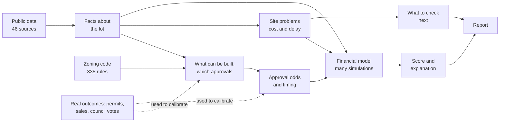

# Screening Pittsburgh Lots for Small Housing Projects: How the System Works (v0)

Research workstream · 26 September 2026 · engine v0.1, contracts 0.1.0

## Summary

A small developer looking at a vacant lot in Pittsburgh has one question: is this site worth
paying lawyers, architects and engineers to study? Today they find out by spending that money.
This system tries to answer the question in under a minute, from public data, before any money
is spent.

The core idea is simple. **A site is risky when the building that fits on it needs a slow,
uncertain approval, costs extra to build because of the ground it sits on, or can't earn enough
to pay for the land.** The system measures each of those three things, turns them into a
score from 0 to 100, and explains every point it takes away.

The first version works end to end on any parcel in Allegheny County in about a hundredth of a
second. It draws on 46 public data sources and 335 rules taken from the city's zoning code.
Some inputs are real measurements, such as past City Council votes, recent home sales and
mapped hazards. Others are still placeholder guesses, most importantly the cost of
construction. Those placeholders currently decide most of the outcomes, so calibrating them is
the main job ahead.

---

## 1. What decision this supports

The user is a small developer building 3 to 20 homes. For a given lot, the system should tell
them:

- whether the lot is worth pursuing,
- what could kill the deal,
- what they could build, and how much they could afford to pay for the land,
- what to check first, cheapest first.

Three rules shape every answer:

- **It is a screen, not a ruling.** It never says a project is "approved" or "compliant", only
  what the zoning code allows as of a given date.
- **Every estimate is a range.** Numbers are shown as a low, middle and high value (the 10th,
  50th and 90th percentile of many simulated outcomes), because the inputs are uncertain.
- **Missing data is never good news.** If the system doesn't know something, it says
  "unknown" and adds a step to find out. It never treats a gap as a clean result.

## 2. How the pieces fit together

The system keeps two kinds of information strictly apart:

- **Facts** are things you can measure directly from data: how big the lot is, how much of it
  is on a steep slope, how far it is from a contaminated site.
- **Judgments** need a model or an assumption: how much the slope adds to the cost, how likely
  an approval is, what the score should be.

Facts are gathered first and handed over in one fixed format. Judgments are then computed from
those facts plus a set of versioned rules and assumptions, and nothing else. That makes every
result reproducible: the same lot with the same data always gets the same answer.

## 3. What the system knows about a lot

Every fact is one of three simple kinds:

- **A share of the lot**, from 0 to 1. For example, "84% of the lot is on a slope of 25% or
  more". These are computed by overlaying the lot's outline on each map layer.
- **A distance**, in feet. For example, "92 ft to an inactive registered storage tank".
- **A list of nearby records**. For example, "97 home sales within half a mile in the last
  three years".

The facts cover the lot itself (size, current use, whether there is a building, assessed value,
who owns it), its zoning, physical hazards (steep slopes, landslide-prone ground, old coal mines,
flood zones), nearby contamination records, street access and sewer type, distance to frequent
transit, whether the neighbouring lots are built on, any tax liens or condemnation, and the local
market (recent sales and government rent benchmarks).

**Why shares and not yes/no.** Pittsburgh is hilly and sits on old coal mines. Across the city's
142,000 parcels, 52% touch some steep slope, 32% sit in the mapped undermined area and 87% are
in a combined sewer area. A yes/no flag would mark most of the city as risky. What matters is
*how much* of the lot is affected, so the rules work on shares.

**How fresh the data is.** The data comes from the sources' own public APIs, in two ways. A
nightly job checks each source on its own schedule (daily for sales and permits, weekly for
assessments and liens, monthly for maps) and re-downloads it only if it has changed. And when a
report is requested, the records that change most often for that lot (its assessment, liens,
condemned status, city ownership, permits, and any new nearby sales) are fetched live. If a
live lookup fails, the stored copy is used and the report says so. Every fact records whether it
was live or stored, and when.

**Known gaps.** Some hazard maps only cover the City of Pittsburgh, so suburban lots get
"unknown" for those. Past zoning board decisions aren't available yet (the city's site blocks
automated access), which limits the approval model (Section 6).

## 4. What can be built, and what approval it needs

**The zoning code, turned into data.** We encoded the parts of the city's zoning code that
matter for small housing as 335 rows. Each row states one rule for one district, with the exact
section of the code it comes from and the date it took effect:

- 182 rows of dimensions: minimum lot size, how far the building must stay from each property
  line (setbacks), maximum height and number of stories.
- 120 rows saying which housing types each district allows, and how: allowed outright, or only
  after one of several kinds of approval.
- 33 rows of other standards: parking, grading on slopes, flood and mine rules, backyard units.

When the city changes its code, the rules change as data, with a new effective date. No
software has to change.

**How much fits on the lot.** Pittsburgh's residential districts don't cap the number of homes
per acre. The limit comes from geometry: take the lot's width and depth, subtract the required
setbacks, and multiply by the allowed number of stories.

> buildable floor area = (width − both side setbacks) × (depth − front and rear setbacks) × stories

On the narrow 25 to 35 ft lots common in Pittsburgh, two rules in the code make a big
difference, and the system applies both:

- **Matching the neighbours.** If the houses on both sides are built close to the property line,
  a new building may match them, down to 3 ft. We can see whether the neighbouring lots are built
  on, but not exactly where their walls are, so this is treated as a best case that the
  developer should confirm with a survey.
- **Narrow lots.** A single house on a lot under 60 ft wide gets smaller side yards automatically.

**Testing building types.** The system tries five kinds of project: a single house, a duplex,
a triplex, a row of 2 to 8 townhomes, and a walk-up apartment building of 4 to 12 units. For
each, it checks whether the building fits and whether the district allows it. Anything that
doesn't comply becomes an item on a list of approvals needed.

**The approval ladder.** Each kind of approval is decided by a different body, and each step up
takes longer and is less certain:

| Approval | Who decides |
|---|---|
| None needed ("by right") | The permit desk |
| Administrator exception | The Zoning Administrator |
| Special exception | The Zoning Board, at a public hearing |
| Variance | The Zoning Board, which must find a hardship |
| Conditional use | The Planning Commission, then City Council |
| Rezoning | City Council |

Two judgment calls keep the options realistic. If a building misses a dimensional rule by more
than 25%, we assume a variance is unlikely and don't offer that option. And we don't offer
projects that would need the district's allowed uses changed.

**Extra rules for mines and floods.** Some areas have overlay rules on top of the district:

- Over old mines, anything bigger than a single house needs a professional site investigation
  before it can be approved.
- In a flood zone, the lowest floor must sit 1.5 ft above the expected flood level, which in
  practice means no basement.
- In the floodway itself (the river channel and its banks), new building needs an engineering
  study showing it won't raise flood levels. We treat this as close to a deal-breaker.

The result of this step is two candidate projects: the best one allowed outright, and the best
one that needs approvals, each with its list of approvals.

**Every check is kept, pass or fail.** For each building type the system records every rule it
applied: whether it passed, and if not, how far short it fell and which approval would fix it.
This is what lets the report show, rule by rule, why a duplex is allowed and a walk-up is not.
It also makes clear where probability comes in. Rules themselves are simply pass or fail. Odds
only appear when a failed rule can be fixed by an approval, and a building's approval odds are
the odds of all the approvals it needs, multiplied together. A building that passes every rule
is allowed outright.

## 5. What could go wrong on the site

Each physical or legal problem becomes a **flag**. A flag says how serious the problem is, a
range for how much it might add to the cost, a range for how much time it might add, how
confident we are, and how to resolve it.

Seriousness depends on how much of the lot is affected. Steep slope, for example:

- more than half the lot: serious, adding roughly $40k to $150k and 1 to 4 months,
- 15% to 50%: moderate, roughly $15k to $60k,
- less than 15%: minor, roughly $5k to $20k.

The other flags cover landslide-prone ground, old mines (stricter for multi-home projects),
flood zones, nearby contamination records, lots with no street frontage, combined sewers,
existing buildings to demolish, condemned properties and unpaid tax liens (costed at the lien
amount). When a fact is missing, the system raises an "unknown" flag instead.

All cost and time ranges in this version are expert placeholders, listed in Appendix B.

## 6. How likely the approvals are, and how long they take

For each approval a project needs, the system estimates the chance it will be granted and how
many months it will take.

- **Measured from real decisions.** City Council records from 2000 to 2026 give us two kinds of
  approval. Of 29 conditional uses that reached a decision, 27 passed, typically in about 60
  days (with 10% taking under 44 days and 10% over 162). Of 101 rezonings, 91 passed, typically
  in 79 days. We turn these counts into a probability range with a standard Beta distribution,
  which is wider when there are fewer cases.
- **A caution.** These rates are flattering. Applications that were withdrawn before a vote,
  often the weak ones, never show up in the records.
- **Educated guesses for the rest.** Past Zoning Board decisions aren't available yet, so for
  exceptions and variances we use expert ranges for now. For a variance, for example, the
  chance of approval is assumed to be somewhere between 50% and 85%, most likely 70%, taking
  2 to 7 months.
- **Several approvals at once.** Approvals are treated as independent, so their chances
  multiply. Requests to the same body are heard together (the time is that of the longest one);
  requests to different bodies happen one after another (the times add up).

The time until the project can get a building permit is then the city's permit review time
plus whichever takes longer: the approvals or the site studies.

## 7. Whether the project makes money

The financial model asks: what could the finished homes sell (or rent) for, what would it cost
to build them, and so how much is left over to pay for the land?

**What the homes are worth.** The system looks at recent home sales within half a mile.

- If at least five newly built homes (built since 2010) sold nearby, it uses their price per
  square foot directly.
- If not, it uses older homes and adds an assumed premium for new construction.
- For apartment buildings it also estimates a rental value: yearly rent from government
  benchmarks, minus operating costs, divided by an investor's expected return (the cap rate).
  Whichever value is higher is used, since a developer would pick the better exit.

**What it costs.** The model adds up construction cost per square foot, design and permit fees,
a contingency, the cost of the site problems from Section 5, and interest: on the land for the
whole time it takes to get permits and build, and on the construction spending while building.

**The key output is the maximum land price**, also called the residual land value: the most a
developer could pay for the land and still earn their target profit (15% on cost by default).

> maximum land price = (sale value ÷ 1.15 − all other costs) ÷ (1 + interest on the land while waiting)

If this number is negative, the project loses money even if the land is free.

**Handling uncertainty.** Instead of one estimate, the model runs 2,000 simulations. Each draws
the uncertain inputs (costs, prices, delays, approval odds) at random from their ranges. The
report shows the 10th, 50th and 90th percentile of the results. In this version the inputs are
drawn independently of each other.

## 8. The score

The score adds up three parts, so every point can be traced to one of them:

- **Approval path (up to 35 points).** Full points for a project that needs no approval and can
  start quickly. Points fall with lower odds of approval and with longer waits: a 6-month wait
  alone cuts the approval points by about 28%.
- **Site cost (up to 35 points).** Full points when there are no costly site problems. Points
  fall as those costs grow, reaching zero when they make up 30% of the total project cost.
- **Land headroom (up to 30 points).** Full points when the maximum land price is at least 1.5
  times the asking price (or the assessed value, if no asking price is given). Zero when the
  project can't pay for its land.

In formula form, with P the approval probability, M the months to a permit, π the share of cost
from site problems and L\* the maximum land price:

> score = 35 × P × e^(−M/18) + 35 × (1 − π/0.30) + 30 × L\* / (1.5 × land price), each part capped between 0 and its maximum

The score is computed in every simulation, and the report shows the middle value with its range.
Scores of 75 and up are **fast track**, 50 to 74 **feasible with conditions**, and below 50
**high risk**. A site can't be called fast track if any important finding is low-confidence.

The weights (35/35/30) and the two scale constants (18 months, 30%) are starting values, not yet
fitted to real outcomes.

**Why we changed the score.** The original design multiplied approval, time and cost together,
and ignored profit. In testing, one lot scored 78 ("fast track") while the project would lose
20% on cost. Adding land headroom fixed that, and adding the parts (rather than multiplying
them) lets the report say exactly where the points went.

**Which project the verdict is about.** The verdict describes one project. The rule: if a
project allowed outright makes money, use it. If not, use whichever profitable project has the
best combination of approval odds and profit. If nothing makes money, use the least risky one.
(Without that last rule, the model would prefer a riskier losing project, because multiplying
a loss by a lower chance of approval makes the loss look smaller.)

**Explaining the score.** For each flag, the system asks what the score would be without that
problem. The difference is the number of points that flag cost, and the report lists them from
largest to smallest.

## 9. What to check next

Each flag comes with a concrete check: who does it, and roughly what it costs. The checks are
ordered so that free ones come first (such as a pre-application meeting with City Planning),
followed by the check that is most likely to kill the deal for the least money. The idea is to
spend a little to learn a lot, and to stop early on bad sites.

In this version, how likely a check is to kill a deal is set by the flag's seriousness: 30% for
serious, 10% for moderate, 15% for unknown and 3% for minor. These are placeholders.

## 10. What the report shows

The system produces one structured record per lot, and the report is only a display of that
record:

- **Verdict**: the score and its range, the band, and one plain sentence explaining it.
- **Where the score comes from**: the three parts, each with its points and a one-line reason.
- **Key numbers**: months to a permit, approval odds, the maximum land price compared with the
  asking price, and the extra cost from site problems.
- **What could kill this deal**: the flags, worst first, each with its cost, delay, source, date,
  the section of the code involved and our confidence.
- **What you can build**: the best project allowed outright and the best one needing approvals,
  with profit margin, timing and the approvals needed.
- **Rule by rule**: a table with the zoning rules as rows and the building types as columns.
  Each cell shows a pass, the approval needed (and how far short the building is), or "not
  feasible", with the approval odds and the result at the bottom. Rules that apply to the whole
  site (mines, flooding) and rules not yet checked (such as parking) are listed underneath.
- **What to check next**: the ordered list of checks, with who does each and its cost.
- **Assumptions**: every assumption with its value, range and whether it is measured or a
  placeholder, plus the versions of the rules and data used.

## 11. Testing it on real lots

We picked eight real Pittsburgh lots, each chosen to test one situation while everything else
about the lot is clean:

| Situation tested | Lot | Zoning | Score | Project the verdict describes | Main reason for the score |
|---|---|---|---|---|---|
| Clean lot | 52-H-93 | RM-M | 62, with conditions | 4-unit walk-up, allowed outright | can't pay for land |
| Steep slope | 55-A-137 | R1D-M | 41, high risk | single house, allowed outright | 84% of the lot is steep |
| Old mines | 4-A-303 | RM-M | 55, with conditions | triplex, allowed outright | mine site investigation required |
| Needs an approval | 129-J-37 | R2-L | 56, with conditions | single house, administrator exception | lot smaller than the minimum |
| Flood zone | 80-N-159 | R1A-VH | 49, high risk | single house, allowed outright | half the lot in the flood zone |
| Two zoning districts | 24-J-60 | LNC and R1A-VH | 49, high risk | single house, allowed outright | one district not yet encoded; low confidence |
| City-owned lot | 173-E-82 | RM-M | 61, with conditions | triplex, allowed outright | can't pay for land |
| Outside the city | 176-C-275 | none | not scored | none | suburban zoning not covered; partial report |

Each lot followed the path it was chosen to test. The mine lot triggered the required site
investigation. The two-district lot showed both readings and was marked low confidence. The
suburban lot came back with "unknown" results rather than false clears.

**The main finding.** At the placeholder construction cost of $250 per square foot, *none* of
the eight projects can pay for its land: the maximum land price ranges from −$74k to −$724k.
One unmeasured number is driving every verdict. On the clean lot (52-H-93), the project breaks
even at about $197 per square foot. At $170 it could pay about $139k for the land and would
score 77 (fast track).

**Checks still to run:**

- Do lots that actually got a building permit without any approval since 2019 (65,000 permits)
  score as "allowed outright"? Target: 90% agreement.
- Does the approval model predict held-out decisions better than simply using the average
  approval rate?
- Do a land-use lawyer or architect agree with the flags and approval path on 10 lots? Target:
  8 of 10.

## 12. Limitations and open questions

1. **Construction cost is a guess.** It drives most verdicts. Getting real local cost figures
   from builders is the most valuable next step.
2. **No Zoning Board history yet.** Exceptions and variances (and subdivisions) still rely on
   expert guesses, and the report can't yet show similar past cases.
3. **The score isn't calibrated.** Its weights and constants should be fitted so that the bands
   match real outcomes, such as permits issued and projects completed.
4. **Inputs move independently.** In reality, costs and prices tend to rise and fall together.
   The model ignores that for now.
5. **Old homes stand in for new ones.** Where fewer than five new homes sold nearby, prices come
   from older homes plus an assumed premium.
6. **Some things can't be seen in the data.** Where exactly the neighbours' walls are, how long
   the lot's street frontage is, and how deep the old mine is below the lot (the code's test for
   single homes is 100 ft).
7. **City-only maps.** Slope and mine maps stop at the city line, and suburban zoning is not
   covered yet.
8. **Mixed data dates.** Sources range from 2018 to 2026, and the report shows the oldest one.
9. **The choice of project can flip.** Close to break-even, a small change in cost can switch
   which project the verdict describes, and the score can jump by more than 10 points. On the
   clean lot the score is 62 at $250 per square foot, 53 at $195 and 66 at $190. A smoother
   rule, such as averaging over the candidate projects, is planned for the next version.

---

## Appendix A. Logic ↔ code cross-tabulation

Paths are relative to the repository root. The v0 engine lives in `engine/src/navigator_engine/`.

| Concept (section) | Module · function | Configuration / data |
|---|---|---|
| Source acquisition, provenance (3) | `pipeline/src/navigator_pipeline/fetch.py` · `fetch`, `fetch_wprdc`, `fetch_arcgis`, `fetch_legistar` | `navigator_pipeline/catalog.py` (`SOURCES`) |
| Scheduled refresh (3) | `navigator_pipeline/refresh.py` · `run`, `is_due`, `has_changed`, `tables_for` | `catalog.py` (`REFRESH_DAYS`) |
| Live per-parcel lookups (3) | `navigator_pipeline/live.py` · `fetch_all`; `site_context.py` · `_apply_live` | `TIMEOUT_S`, `CACHE_TTL_S` |
| Cleaning, reprojection, parcel keys (3) | `navigator_pipeline/build.py` · `build_parcels`, `BUILDERS` | — |
| Share / distance facts (3) | `navigator_pipeline/features.py` · `area_shares`, `nearest_distance`, `physical`, `flood`, `zoning`, `environmental`, `infrastructure`, `access`, `ownership` | `ENV_RADIUS_FT`, `FRONTAGE_RADIUS_FT`, `TRANSIT_TIERS` |
| Site fact assembly, adjacency, comps (3) | `navigator_pipeline/site_context.py` · `build` | `COMPS_RADIUS_FT`, `COMPS_YEARS` |
| Fact interface (3, 10) | `contracts/src/navigator_contracts/site_context.py` · `SiteContext` | `contracts/schema/SiteContext.schema.json` |
| Rules extraction (4) | `sandbox/rules/extract.py` · `residential_rows`, `hillside_rows` | `engine/src/navigator_engine/config/rules/residential_draft.csv` |
| Use permissions, standards (4) | read by `engine/src/navigator_engine/rules_engine.py` | `config/rules/use_permissions_draft.csv`, `standards_draft.csv` |
| Envelope, contextual and narrow-lot setbacks (4) | `rules_engine.py` · `envelope`, `lot_dimensions`, `neighbors_built`, `single_unit_side_setback` | `CONTEXTUAL_MIN_SIDE_FT` |
| Programs, relief list, plausibility cap (4) | `rules_engine.py` · `relief_for`, `best_programs`, `TEMPLATES` | `MAX_DIMENSIONAL_SHORTFALL` |
| Rule-by-rule table: every check, pass or fail; odds per building (4, 10) | `rules_engine.py` · `check_program`, `evaluate_programs`, `site_checks`; `analyze.py` · `rule_checks`; `sandbox/report.py` · `rules_block` | `NOT_CHECKED`, `CHECK_LABELS` |
| Overlay procedures (4) | `rules_engine.py` · `overlay_items` | — |
| Flags, thresholds, unknowns (5) | `engine/src/navigator_engine/constraints.py` · `flags` | inline threshold table |
| Entitlement odds and months (6) | `engine/src/navigator_engine/entitlement.py` · `sample` | `RUNGS`, `PROCEDURAL` |
| Council outcomes (6) | `navigator_pipeline/build.py` · `build_council_zoning_matters` | `data/clean/council_zoning_matters.parquet` |
| Comps, rents, exits (7) | `engine/src/navigator_engine/analyze.py` · `sale_psf`, `rent_for`, `proforma` | `NEW_BUILD_YEAR`, `MIN_COMPS` |
| Costs, margin, residual land value, Monte Carlo (7) | `analyze.py` · `proforma` | `assumptions.py`; `N` |
| Score, bands (8) | `analyze.py` · `score_samples`, `band` | `WEIGHTS`; `score_*` assumptions |
| Leading option, attribution, verdict text (8) | `analyze.py` · `analyze`, `explain` | — |
| Recommendations (9) | `analyze.py` · `analyze` (next steps); `constraints.py` actions | `P_KILL` |
| Output interface (10) | `contracts/src/navigator_contracts/site_analysis.py` · `SiteAnalysis` | `contracts/schema/SiteAnalysis.schema.json` |
| Report rendering (10) | `sandbox/report.py` · `render` | — |
| Results bundle for the demo (10) | `navigator_pipeline/publish.py` · `publish`; `bundle.py` · `load` | `results/` (see `results/README.md`) |
| End-to-end run (all) | `sandbox/navigator.py` · `main` | output: `data/output/` |
| Golden parcels (11) | `sandbox/golden.py` · `cases`, `rank` | `fixtures/golden/`, `sandbox/golden_parcels.json` |
| Contract conformance (11) | `contracts/tests/test_golden_fixtures.py` | — |

## Appendix B. Assumptions

| Assumption | Mode | Range | Status |
|---|---|---|---|
| Hard cost per gross sq ft | $250 | $200–320 | placeholder |
| Soft costs (share of hard) | 20% | 15–25% | placeholder |
| Contingency (share of hard + soft) | 7% | 5–10% | placeholder |
| Construction duration | 12 mo | 9–16 | placeholder |
| Carrying cost of capital | 9%/yr | 7–11% | placeholder |
| Target margin on cost | 15% | — | developer input |
| New-construction premium over resale | 25% | 10–40% | placeholder |
| Cap rate (rental exit) | 6.5% | 5.5–7.5% | placeholder |
| Opex + vacancy (share of rent) | 40% | 35–45% | placeholder |
| Permit review | 3 mo | 2–5 | placeholder (permit data lacks application dates) |
| Score: τ, κ, land ratio | 18 mo, 0.30, 1.5× | — | uncalibrated |
| Dimensional-variance plausibility cap | 25% | — | placeholder |
| Flag cost and delay ranges | per flag (§5) | — | placeholder |
| P(kill) by severity | 0.30 / 0.10 / 0.15 / 0.03 | — | placeholder |
| Zoning-board rung priors | per rung (§6) | — | placeholder |
| Conditional use, rezoning odds and durations | Beta(28, 3), Beta(92, 11); observed days | — | measured (council, 2000–2026) |
| Comparable sales, rents | per parcel | — | measured (county sales; HUD) |

## Appendix C. Sources → facts

| Source (steward) | Facts |
|---|---|
| Parcel boundaries, property assessments (Allegheny County via WPRDC) | Parcel geometry, lot area, use, structure, assessed values, owner type |
| Property sale transactions (County) | Comparable sales, prices, validation codes |
| Zoning districts and overlays (City) | District and overlay shares |
| Zoning code, Title Nine (City; manual PDF extraction) | Rules tables |
| ≥25% slope, landslide-prone, undermined areas (City) | Physical shares |
| National Flood Hazard Layer (FEMA) | Flood zone shares |
| eMapPA: land recycling cleanups, storage tanks, mine lands, deep mines (PA DEP) | Environmental records; countywide mining shares |
| Street centerlines, city steps, address points (County, City) | Frontage class, geocoding |
| Combined sewersheds (PWSA); water providers by parcel | Infrastructure proxies |
| Transit stops with weekday trips (Pittsburgh Regional Transit) | Frequent-transit distance |
| Small Area Fair Market Rents; QCT, DDA, Opportunity Zones (HUD) | Rent benchmarks; financing overlays |
| Building permits since 2019 (City PLI) | By-right validation ground truth |
| Zoning legislation 2000–2026 (City Council, Legistar) | Conditional use and rezoning outcomes |
| City-owned property, condemned properties, tax liens (City, County) | Title and public-land facts |
| Market Value Analysis 2021 (URA) | Market typology |

## Appendix D. Glossary

**By right** — permitted without discretionary approval. **Administrator exception** —
minor relief granted by the Zoning Administrator. **Special exception** — use or standard
allowed after a Zoning Board hearing on stated criteria. **Variance** — relief from a
standard on a hardship showing, granted by the Zoning Board. **Conditional use** — use
allowed after Planning Commission review and City Council vote. **UM-O** — Undermined Area
Overlay District. **FP-O** — Floodplain Overlay District. **SFHA** — FEMA Special Flood
Hazard Area (1% annual chance). **BFE** — base flood elevation. **SAFMR** — HUD Small Area
Fair Market Rent. **MVA** — Market Value Analysis (neighbourhood market typology). **Residual
land value (L\*)** — the maximum land price at which the project still earns its target margin.
