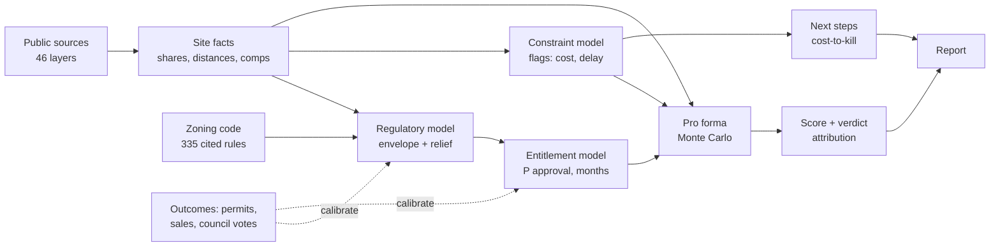

# Parcel-Level Development Feasibility Screening: System Design and v0 Results

Research workstream · 26 Sep 2026 · engine v0.1, contracts 0.1.0 · City of Pittsburgh / Allegheny County

## Abstract

We screen a single parcel for small infill housing (3–20 units) and return a go/no-go signal
before a developer spends on diligence. The system models **risk as the odds, delay and extra
cost of the approval path the best feasible building must take, plus whether the project can
pay for its land**. It combines 46 public data sources, a machine-readable encoding of the
Pittsburgh zoning code (335 cited rules), a regulatory envelope model, an entitlement model,
and a Monte Carlo pro forma, and emits a 0–100 score whose every point is attributed to a
named component and flag. v0 runs end to end in ~0.01 s per parcel. Entitlement odds for two
approval paths are measured; construction costs and zoning-board odds are placeholders, and
at current placeholder costs no golden parcel clears its land price. Calibration is the main
open problem.

---

## 1. Decision and objective

**Decision supported.** For a given parcel: *is it worth spending diligence money on, and on
what first?*

**Output contract.** A screening verdict, never a zoning determination; every estimate is a
p10/p50/p90 range; every finding carries its source, date and confidence; a missing fact is
reported as *unknown*, never as clear.

**Unit of analysis.** One parcel (or an assemblage of adjacent parcels), evaluated against the
zoning code in force on a stated date.

## 2. System overview

The system separates **facts** (measurable from data without assumptions) from **judgments**
(anything requiring a model, threshold or assumption). The two meet at a single typed
interface. Judgments are a pure function of the facts plus versioned configuration.

Properties: deterministic (fixed seed), no I/O inside the judgment layer, ~0.01 s per parcel.

## 3. Inputs: site facts

Each fact is one of three kinds, with fixed semantics:

| Kind | Definition | Example |
|---|---|---|
| Share | Fraction of lot area (0–1) covered by a polygon layer, computed by exact intersection over non-overlapping pieces | 0.84 of the lot on ≥25% slope |
| Distance | Feet from the lot boundary to the nearest feature | 92 ft to an inactive storage tank |
| Record set | Items within a radius, with attributes | 97 arm's-length sales within 0.5 mi, last 3 years |

`null` means **unknown** (e.g. a city-only layer for a suburban parcel), with the reason
recorded per layer; it is never coerced to zero. Geometry is in PA State Plane South (US
feet), so areas and setbacks are native units. Parcels are keyed by county ID with the city
block-lot alongside.

**Fact groups.** Parcel (area, use, structure, assessed values, owner type) · zoning (district
and overlay shares) · physical (slope, landslide-prone, undermined, deep-mined, abandoned-mine
shares; FEMA flood zone shares) · environmental (state cleanup and tank records within
1,000 ft) · infrastructure and access (frontage class within 60 ft, combined sewershed,
distance to frequent transit ≥64 weekday trips) · adjacency (neighbours sharing a lot line,
built or not) · title (liens, condemnation, public inventory) · market (arm's-length sales
with building size and year built; HUD small-area rents by bedroom).

**Base rates** (142,329 city parcels) motivate threshold design: 52% touch ≥25% slope, 32%
lie in the undermined overlay, 87% in a combined sewershed, 1.5% in the 1% flood zone, 7% are
split-zoned. Presence flags would fire on most of the city; severity must key on shares.

**Coverage limits.** Slope, landslide and undermining layers exist for the city only (a
countywide slope surface from 1 m LiDAR is planned). Zoning-board decisions are not yet
obtainable. Water provider covers 34% of county parcels.

## 4. Regulatory model

**Rules as data.** The code is encoded as rows `(district, standard, value, code section,
effective date, source page)`: 182 dimensional rows (lot size, setbacks, height, stories),
120 use permissions (5 residential product types × 24 districts, each permitted by right,
by administrator exception, special exception, conditional use, or not at all), and 33
cross-cutting standards (parking, grading, overlays, accessory units). A code amendment is a
new versioned row set, not a code change.

**Envelope.** Pittsburgh's residential districts impose no density or coverage cap; capacity
is set by geometry. With lot width *W*, depth *D* (minimum rotated rectangle), side, front and
rear setbacks *s, f, r*, and permitted stories *n*:

> buildable floor area = (W − 2s) · (D − f − r) · n

Two regulatory refinements change results materially on typical 25–35 ft lots:

- **Contextual side setbacks.** Where both neighbours are built, side yards may match theirs
  down to 3 ft. Evaluated as a second scenario; neighbour setbacks are not observed, so it is
  a best case that generates a verification step.
- **Narrow-lot rule.** Single houses on lots under 60 ft wide get reduced side yards (3–5 ft)
  regardless of neighbours.

**Programs.** Five product templates (single house, duplex, triplex, 2–8 townhomes, 4–12 unit
walk-up), each with unit size, stories and efficiency (all editable assumptions). Each
program is tested against the envelope and the use table, yielding a **relief list**.

**Relief ladder.** Each relief item maps to an approval rung with a known decision-maker:

| Rung | Decided by |
|---|---|
| By right | Permit desk |
| Administrator exception | Zoning Administrator |
| Special exception | Zoning Board of Adjustment |
| Variance | Zoning Board of Adjustment (hardship test) |
| Conditional use | Planning Commission + City Council |
| Rezoning | City Council |

A dimensional deviation above 25% of the requirement is treated as implausible rather than
as a variance (a judgment to be calibrated on board outcomes). Programs needing a use variance
are not offered.

**Overlays** add procedures on any rung: in the undermined overlay, anything larger than a
single house requires a professional site investigation before approval; in the floodplain
overlay, the lowest floor must sit 1.5 ft above base flood elevation; floodway development
requires a no-rise engineering analysis and is treated as near-prohibitive.

**Outputs.** Best by-right program and best with-relief program, each with its relief list.

## 5. Constraint model

Facts map to **flags** `{severity, cost interval, schedule interval, confidence, resolution}`
through a threshold table. Severity keys on share, not presence; for slope, for example:
≥50% of lot → high ($40–150k, +1–4 months), 15–50% → medium ($15–60k), >0 → low
($5–20k). Other flags: landslide-prone, undermining (tightened for multi-unit programs),
flood zone and floodway, nearby cleanup/tank records, non-street frontage, combined
sewershed, demolition, condemnation, tax liens (cost = lien amount). Every unknown fact
produces a severity-`unknown` flag with the check that would resolve it. All thresholds and
cost ranges in v0 are expert placeholders (Appendix B).

## 6. Entitlement model

Each relief item contributes a probability of approval and a decision duration.

- **Measured rungs.** City Council zoning legislation 2000–2026 gives conditional uses
  (27 of 29 decided passed; decision days p10/p50/p90 = 44/60/162) and rezonings (91 of
  101; 41/79/225). Approval is modelled as Beta(1 + passed, 1 + failed). These rates are
  optimistic: applications withdrawn before a vote are unobserved.
- **Prior rungs.** Administrator exception, special exception, variance, use variance and
  subdivision use triangular priors (e.g. variance P ∈ [0.50, 0.70, 0.85], 2–7 months) until
  zoning-board decisions are extracted.
- **Combination.** Items are independent (P multiplies). Items before the same body are heard
  together (months = max within a body); different bodies are sequential (months add).
  Procedural steps (site investigation, floodway study) add time without a discretionary
  approval.

Months to permit-ready = permit review + max(entitlement months, study months).

## 7. Economic model

**Revenue.** For-sale price per sq ft from arm's-length residential comps with known building
size: if ≥5 were built since 2010, use their interquartile range directly; otherwise use
resale comps × (1 + new-construction premium). Walk-ups also get a rental exit:
units × HUD small-area rent × 12 × (1 − opex ratio) / cap rate. The better median exit wins.

**Cost.** Hard (gross floor area × $/sf) + soft (share of hard) + contingency + constraint
premium (sum of flag cost draws) + carry: on land over permit and construction months, and
on half of hard+soft over construction.

**Outputs.** Margin on cost *R / C − 1*, and **residual land value** at target margin *m*:

> L\* = [ R / (1 + m) − C_nonland ] / [ 1 + r · (M_permit + M_build) / 12 ]

L\* is the most a developer can pay for the land. L\* < 0 means costs plus target profit
exceed value even with free land.

**Uncertainty.** Monte Carlo with 2,000 draws: triangular draws for costs, durations, premium
and cap rate; uniform for flag costs; triangular over the comps' interquartile range for
price; per-rung distributions for approval. Inputs are independent in v0. All outputs are
reported as p10/p50/p90.

## 8. Score and verdict

The score is additive so that every point belongs to a named, explainable component:

> S = 35 · P · e^(−M/τ)  +  35 · clip(1 − π/κ, 0, 1)  +  30 · clip(L\* / (1.5 · L_price), 0, 1)

| Component | Meaning | Parameters (v0, uncalibrated) |
|---|---|---|
| Approval path (35) | Probability of approval, discounted by months to permit-ready *M* | τ = 18 months |
| Site cost (35) | Constraint premium as a share π of total development cost | κ = 0.30 (score 0 at 30%) |
| Land headroom (30) | Residual land value relative to the land price (asking, else assessed) | full points at L\* ≥ 1.5 × price |

S is computed per Monte Carlo draw; the reported score is the median with a p10–p90 range.
Bands: ≥75 fast track, 50–74 feasible with conditions, <50 high risk. A fast-track band is
downgraded if any non-trivial finding has low confidence.

**Why additive, and why land headroom.** A multiplicative score of approval, time and cost
factors (the original specification) is blind to profitability: in testing, a parcel scored
78 ("fast track") while losing 20% on cost. Adding land headroom closes that gap and lets the
report state *why* each point was lost.

**Leading option.** The program the verdict describes: a profitable by-right program if one
exists; otherwise the profitable option with the highest P × margin; otherwise the lowest-risk
option. (Ranking losses by P × margin would reward the riskier loss.)

**Attribution.** Each flag's contribution is its counterfactual: remove the flag, recompute
the median score, report the points regained. Relief is attributed the same way.

## 9. Recommendations

Each flag maps to a verification action with an owner and a cost range. Steps are ordered
free-first, then by **cost-to-kill** = P(check kills the deal) / cost of the check, with
P(kill) set by severity (high 0.30, medium 0.10, unknown 0.15, low 0.03; placeholders). The
intent is value of information: the cheapest check most likely to end the deal goes first.

## 10. Output structure

One typed object per parcel drives the report; the renderer only formats it.

| Report block | Content |
|---|---|
| Verdict | Band, score and range, land-price risk, one-sentence summary |
| Where the score comes from | Three components: points, maximum, one-line reason |
| Headline numbers | Months to permit-ready, approval probability, max land price vs. land price, site cost premium, comps used |
| What could kill this deal | Flags worst-first with cost, delay, source, date, code section, confidence, resolving step |
| What you can build | Best by-right and best with-relief programs: units, margin, months, relief with code sections |
| What to check next | Ordered steps with owner and cost |
| Assumptions and versions | Every assumption with value, range, source status; engine, ruleset, schema, data dates |

## 11. Validation

**Golden parcels.** Eight real parcels, each chosen to isolate one condition (others off):

| Case | Parcel | Zoning | Score (band) | Leading option | Main driver |
|---|---|---|---|---|---|
| Clean by-right | 52-H-93 | RM-M | 62 (conditions) | 4-unit walk-up, by right | land headroom |
| Steep slope | 55-A-137 | R1D-M | 41 (high risk) | single house, by right | slope (84% of lot) |
| Undermined | 4-A-303 | RM-M | 55 (conditions) | triplex, by right | undermining → site investigation |
| Needs variance | 129-J-37 | R2-L | 56 (conditions) | single house, admin. exception | undersized lot |
| Flood zone | 80-N-159 | R1A-VH | 49 (high risk) | single house, by right | 51% in 1% flood zone |
| Split-zoned | 24-J-60 | LNC / R1A-VH | 49 (high risk) | single house, by right | uncovered district, low confidence |
| Public vacant | 173-E-82 | RM-M | 61 (conditions) | triplex, by right | land headroom |
| Outside city | 176-C-275 | — | not scored | — | zoning not covered; partial report |

Each exercises its intended path (e.g. the undermined parcel triggers the site-investigation
procedure; the split-zoned parcel reports both districts and low confidence; the suburban
parcel returns unknowns, not clears).

**Headline finding.** At the placeholder hard cost ($250/sf), land headroom is 0/30 for every
golden parcel: median residual land value ranges from −$74k to −$724k. Results are dominated
by one unmeasured input. On 52-H-93 the by-right break-even hard cost (median L\* = 0 at a
15% margin) is ≈ $197/sf; at $170/sf the same lot supports ≈ $139k of land (median) and scores
77 (fast track).

**Planned checks** (not yet run): by-right agreement against 65k building permits since 2019
(target ≥90%); entitlement backtest on held-out cases (beat base-rate Brier score; interval
coverage); agreement with a land-use professional on 10 sites (target 8/10).

## 12. Limitations and open problems

1. **Cost calibration.** Hard cost is a placeholder and drives most verdicts; local builder
   benchmarks are the highest-value missing input.
2. **Zoning-board data.** Decisions are not yet obtainable; four rungs rely on priors and the
   report cannot show precedents.
3. **Score shape.** Weights, τ, κ and the 1.5× land ratio are uncalibrated; they should be fit
   so bands predict realised outcomes (permits issued, projects completed).
4. **Independence.** Approval items, cost inputs and price are sampled independently;
   correlated shocks (e.g. cost and price cycles) are ignored.
5. **Comparable quality.** Resale comps plus a premium stand in for new-construction prices
   where fewer than five new builds sold nearby.
6. **Unobserved geometry.** Neighbour setbacks (for contextual setbacks), lot frontage length
   and mine depth (the 100 ft overburden test) are not in the data.
7. **Coverage.** Hazard layers stop at the city line; suburban zoning is out of scope for v1.
8. **Data dates.** Sources range from 2018 to 2026; the reported data date is the oldest input.
9. **Discontinuous option rule.** Near break-even, a small input change can switch the leading
   option and move the score by more than 10 points. On 52-H-93 the score is 62 at $250/sf,
   53 at $195/sf (only the with-relief option is profitable, so it leads) and 66 at $190/sf. A
   smooth alternative, e.g. the expectation over options weighted by P × margin, is a
   candidate for v1.

---

## Appendix A. Logic ↔ code cross-tabulation

Paths are relative to the repository root. The v0 engine lives in `sandbox/engine_v0/` and
will move to `engine/` unchanged in logic.

| Concept (section) | Module · function | Configuration / data |
|---|---|---|
| Source acquisition, provenance (3) | `sandbox/fetch.py` · `fetch`, `fetch_wprdc`, `fetch_arcgis`, `fetch_legistar` | `sandbox/catalog.py` (`SOURCES`) |
| Cleaning, reprojection, parcel keys (3) | `sandbox/build.py` · `build_parcels`, `BUILDERS` | — |
| Share / distance facts (3) | `sandbox/features.py` · `area_shares`, `nearest_distance`, `physical`, `flood`, `zoning`, `environmental`, `infrastructure`, `access`, `ownership` | `ENV_RADIUS_FT`, `FRONTAGE_RADIUS_FT`, `TRANSIT_TIERS` |
| Site fact assembly, adjacency, comps (3) | `sandbox/site_context.py` · `build` | `COMPS_RADIUS_FT`, `COMPS_YEARS` |
| Fact interface (3, 10) | `contracts/src/navigator_contracts/site_context.py` · `SiteContext` | `contracts/schema/SiteContext.schema.json` |
| Rules extraction (4) | `sandbox/rules/extract.py` · `residential_rows`, `hillside_rows` | `sandbox/rules/residential_draft.csv` |
| Use permissions, standards (4) | read by `sandbox/engine_v0/rules_engine.py` | `sandbox/rules/use_permissions_draft.csv`, `standards_draft.csv` |
| Envelope, contextual and narrow-lot setbacks (4) | `rules_engine.py` · `envelope`, `lot_dimensions`, `neighbors_built`, `single_unit_side_setback` | `CONTEXTUAL_MIN_SIDE_FT` |
| Programs, relief list, plausibility cap (4) | `rules_engine.py` · `relief_for`, `best_programs`, `TEMPLATES` | `MAX_DIMENSIONAL_SHORTFALL` |
| Overlay procedures (4) | `rules_engine.py` · `overlay_items` | — |
| Flags, thresholds, unknowns (5) | `sandbox/engine_v0/constraints.py` · `flags` | inline threshold table |
| Entitlement odds and months (6) | `sandbox/engine_v0/entitlement.py` · `sample` | `RUNGS`, `PROCEDURAL` |
| Council outcomes (6) | `sandbox/build.py` · `build_council_zoning_matters` | `sandbox/data/clean/council_zoning_matters.parquet` |
| Comps, rents, exits (7) | `sandbox/engine_v0/analyze.py` · `sale_psf`, `rent_for`, `proforma` | `NEW_BUILD_YEAR`, `MIN_COMPS` |
| Costs, margin, residual land value, Monte Carlo (7) | `analyze.py` · `proforma` | `sandbox/engine_v0/assumptions.py`; `N` |
| Score, bands (8) | `analyze.py` · `score_samples`, `band` | `WEIGHTS`; `score_*` assumptions |
| Leading option, attribution, verdict text (8) | `analyze.py` · `analyze`, `explain` | — |
| Recommendations (9) | `analyze.py` · `analyze` (next steps); `constraints.py` actions | `P_KILL` |
| Output interface (10) | `contracts/src/navigator_contracts/site_analysis.py` · `SiteAnalysis` | `contracts/schema/SiteAnalysis.schema.json` |
| Report rendering (10) | `sandbox/report.py` · `render` | — |
| End-to-end run (all) | `sandbox/navigator.py` · `main` | output: `sandbox/data/output/` |
| Golden parcels (11) | `sandbox/golden.py` · `cases`, `rank` | `fixtures/golden/`, `sandbox/golden_parcels.json` |
| Contract conformance (11) | `contracts/tests/test_golden_fixtures.py` | — |

## Appendix B. Assumptions

| Assumption | Mode | Range | Status |
|---|---|---|---|
| Hard cost per gross sq ft | $250 | $200–320 | placeholder |
| Soft costs (share of hard) | 20% | 15–25% | placeholder |
| Contingency (share of hard + soft) | 7% | 5–10% | placeholder |
| Construction duration | 12 mo | 9–16 | placeholder |
| Carrying cost of capital | 9%/yr | 7–11% | placeholder |
| Target margin on cost | 15% | — | developer input |
| New-construction premium over resale | 25% | 10–40% | placeholder |
| Cap rate (rental exit) | 6.5% | 5.5–7.5% | placeholder |
| Opex + vacancy (share of rent) | 40% | 35–45% | placeholder |
| Permit review | 3 mo | 2–5 | placeholder (permit data lacks application dates) |
| Score: τ, κ, land ratio | 18 mo, 0.30, 1.5× | — | uncalibrated |
| Dimensional-variance plausibility cap | 25% | — | placeholder |
| Flag cost and delay ranges | per flag (§5) | — | placeholder |
| P(kill) by severity | 0.30 / 0.10 / 0.15 / 0.03 | — | placeholder |
| Zoning-board rung priors | per rung (§6) | — | placeholder |
| Conditional use, rezoning odds and durations | Beta(28, 3), Beta(92, 11); observed days | — | measured (council, 2000–2026) |
| Comparable sales, rents | per parcel | — | measured (county sales; HUD) |

## Appendix C. Sources → facts

| Source (steward) | Facts |
|---|---|
| Parcel boundaries, property assessments (Allegheny County via WPRDC) | Parcel geometry, lot area, use, structure, assessed values, owner type |
| Property sale transactions (County) | Comparable sales, prices, validation codes |
| Zoning districts and overlays (City) | District and overlay shares |
| Zoning code, Title Nine (City; manual PDF extraction) | Rules tables |
| ≥25% slope, landslide-prone, undermined areas (City) | Physical shares |
| National Flood Hazard Layer (FEMA) | Flood zone shares |
| eMapPA: land recycling cleanups, storage tanks, mine lands, deep mines (PA DEP) | Environmental records; countywide mining shares |
| Street centerlines, city steps, address points (County, City) | Frontage class, geocoding |
| Combined sewersheds (PWSA); water providers by parcel | Infrastructure proxies |
| Transit stops with weekday trips (Pittsburgh Regional Transit) | Frequent-transit distance |
| Small Area Fair Market Rents; QCT, DDA, Opportunity Zones (HUD) | Rent benchmarks; financing overlays |
| Building permits since 2019 (City PLI) | By-right validation ground truth |
| Zoning legislation 2000–2026 (City Council, Legistar) | Conditional use and rezoning outcomes |
| City-owned property, condemned properties, tax liens (City, County) | Title and public-land facts |
| Market Value Analysis 2021 (URA) | Market typology |

## Appendix D. Glossary

**By right** — permitted without discretionary approval. **Administrator exception** —
minor relief granted by the Zoning Administrator. **Special exception** — use or standard
allowed after a Zoning Board hearing on stated criteria. **Variance** — relief from a
standard on a hardship showing, granted by the Zoning Board. **Conditional use** — use
allowed after Planning Commission review and City Council vote. **UM-O** — Undermined Area
Overlay District. **FP-O** — Floodplain Overlay District. **SFHA** — FEMA Special Flood
Hazard Area (1% annual chance). **BFE** — base flood elevation. **SAFMR** — HUD Small Area
Fair Market Rent. **MVA** — Market Value Analysis (neighbourhood market typology). **Residual
land value (L\*)** — the maximum land price at which the project still earns its target margin.
